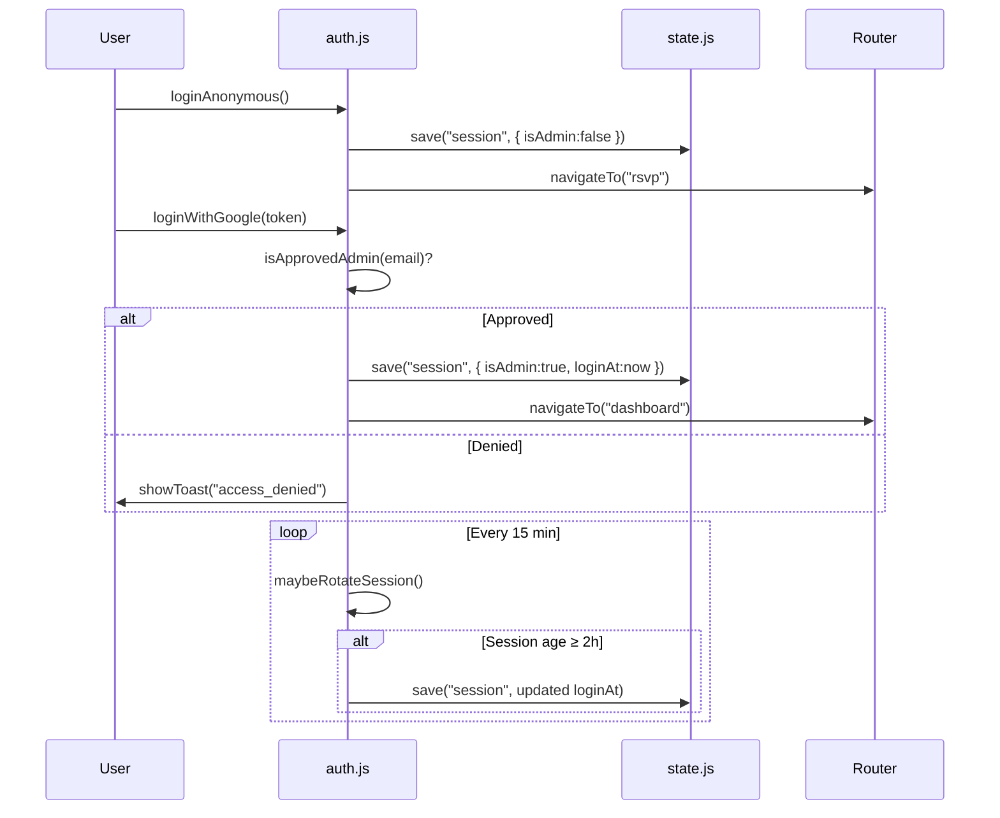
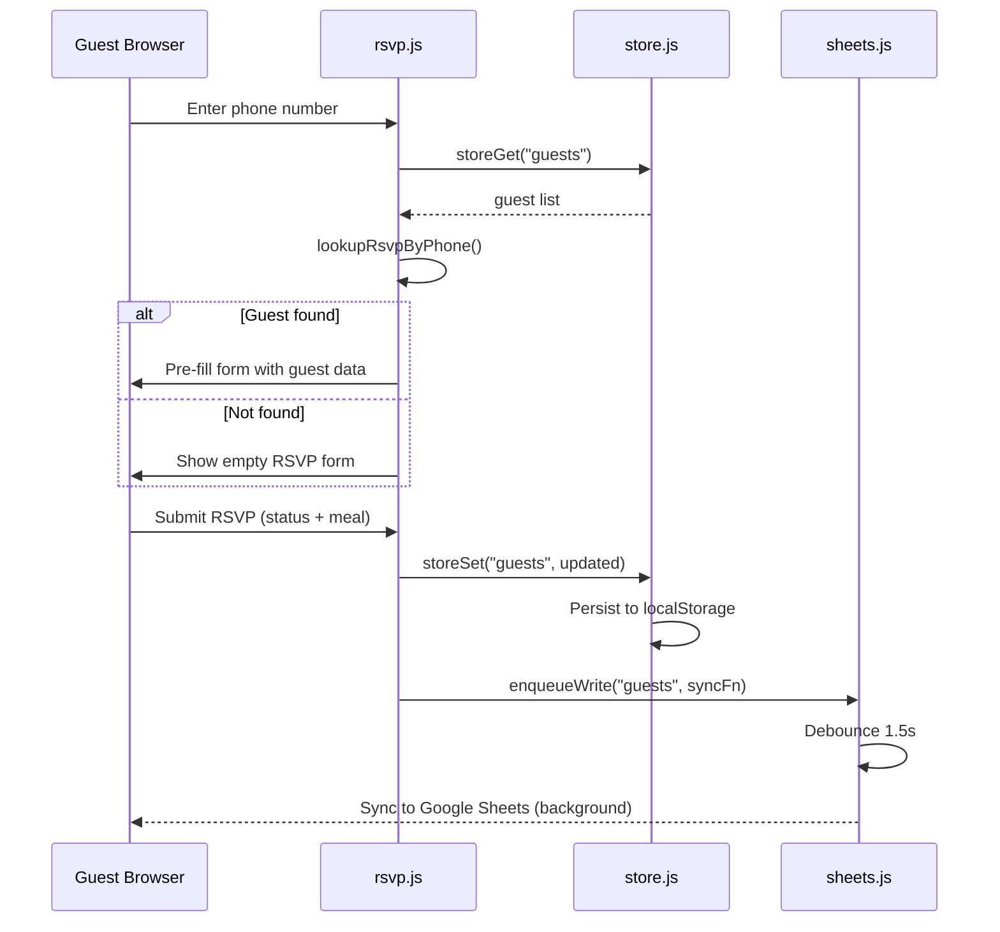
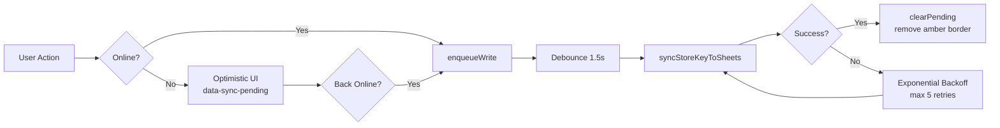
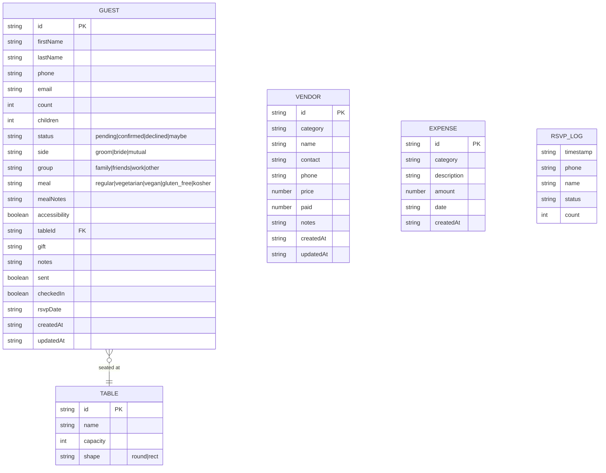
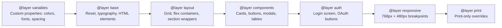

# Wedding Manager — Architecture (v6.7.0)

> Entry point: `src/main.js` · Pure ESM · Zero `window.*` side effects

## Module Dependency Graph

```mermaid
graph TD
    HTML["index.html"] --> MAIN["src/main.js<br/>(bootstrap + event hub)"]

    subgraph Core ["src/core/"]
        STORE["store.js<br/>Proxy-based reactive store"]
        EVENTS["events.js<br/>data-action delegation"]
        I18N["i18n.js<br/>Hebrew (eager) + English (lazy)"]
        STATE["state.js<br/>localStorage load/save"]
        NAV["nav.js<br/>hash router + swipe"]
        UI["ui.js<br/>toast · modal · theme"]
        DOM["dom.js<br/>cached el refs"]
        TPLL["template-loader.js<br/>lazy HTML injection"]
    end

    subgraph Services ["src/services/"]
        AUTH["auth.js<br/>Google · Facebook · Apple · Anonymous"]
        SHEETS["sheets.js<br/>Google Sheets sync + queue"]
    end

    subgraph Sections ["src/sections/"]
        DASHBOARD["dashboard.js"]
        GUESTS["guests.js"]
        TABLES["tables.js"]
        VENDORS["vendors.js"]
        EXPENSES["expenses.js"]
        BUDGET["budget.js"]
        ANALYTICS["analytics.js"]
        RSVP["rsvp.js"]
        CHECKIN["checkin.js"]
        GALLERY["gallery.js"]
        TIMELINE["timeline.js"]
        INVITATION["invitation.js"]
        WHATSAPP["whatsapp.js"]
        SETTINGS["settings.js"]
        LANDING["landing.js"]
        CONTACT["contact-collector.js"]
        REGISTRY["registry.js"]
        GUESTLANDING["guest-landing.js"]
    end

    subgraph Utils ["src/utils/"]
        SANITIZE["sanitize.js"]
        PHONE["phone.js"]
        DATE["date.js"]
        MISC["misc.js (uid)"]
    end

    MAIN --> STORE
    MAIN --> EVENTS
    MAIN --> I18N
    MAIN --> STATE
    MAIN --> NAV
    MAIN --> UI
    MAIN --> TPLL
    MAIN --> AUTH
    MAIN --> SHEETS

    MAIN --> DASHBOARD
    MAIN --> GUESTS
    MAIN --> TABLES
    MAIN --> SETTINGS
    MAIN --> VENDORS
    MAIN --> EXPENSES
    MAIN --> BUDGET
    MAIN --> ANALYTICS
    MAIN --> RSVP
    MAIN --> CHECKIN
    MAIN --> GALLERY
    MAIN --> TIMELINE
    MAIN --> INVITATION
    MAIN --> WHATSAPP
    MAIN --> LANDING
    MAIN --> CONTACT
    MAIN --> REGISTRY
    MAIN --> GUESTLANDING

    GUESTS --> STORE
    GUESTS --> SANITIZE
    GUESTS --> PHONE
    GUESTS --> SHEETS
    TABLES --> STORE
    TABLES --> SANITIZE
    VENDORS --> STORE
    VENDORS --> SANITIZE
    VENDORS --> SHEETS
    EXPENSES --> STORE
    EXPENSES --> SANITIZE
    RSVP --> STORE
    RSVP --> SANITIZE
    RSVP --> PHONE
    ANALYTICS --> STORE
    DASHBOARD --> STORE
    DASHBOARD --> DATE
    SETTINGS --> STORE
    SETTINGS --> STATE
    SETTINGS --> SANITIZE
    SETTINGS --> SHEETS
    SHEETS --> STATE
    AUTH --> STATE
    AUTH --> MISC
```



## Layer Overview

| Layer     | Path             | Responsibility                                                |
| --------- | ---------------- | ------------------------------------------------------------- |
| Bootstrap | `src/main.js`    | App init, event wiring, section lifecycle                     |
| Core      | `src/core/`      | Store, events, i18n, nav, UI, DOM, config, constants, actions |
| Handlers  | `src/handlers/`  | Action handler registration; bridge between events and logic  |
| Sections  | `src/sections/`  | Feature modules — mount/unmount lifecycle                     |
| Services  | `src/services/`  | Auth, Sheets, Supabase, backend, presence, offline queue      |
| Utils     | `src/utils/`     | Pure helpers: sanitize, phone, date, misc, form-helpers, undo |
| Plugins   | `src/plugins/`   | Optional feature plugins with mount/unmount/i18n contract     |
| Templates | `src/templates/` | Lazy-loaded HTML fragments (injected on first visit)          |
| Modals    | `src/modals/`    | Reusable modal HTML fragments                                 |

## Data Flow

```
User Action (click/submit)
  → data-action attribute
  → events.js delegation
  → src/main.js handler
  → section function (e.g., saveGuest)
  → store.js (reactive Proxy)
  → storeSubscribe callback → re-render
  → sheets.js write queue (debounced 1.5 s)
  → Google Sheets Apps Script Web App
```

## Build

- **Vite 8** — entry `src/main.js`
- Manual chunks: `locale-en`, `chunk-public`, `chunk-analytics`, `chunk-gallery`
- Service Worker: `public/sw.js` with precache list
- Deploy: GitHub Pages via `dist/`

---

## Auth Flow (S4.1)



## RSVP Data Flow



## Offline Sync Flow (S3.9)



## Data Model (ER Diagram)



## CSS Layer Order


