# Wedding Manager — Architecture (v12.4.0)

> Runtime entry: `src/main.js` · Pure ESM · Vite 8 · Google Sheets remains the active backend path

## Scope

This is a **pure web application**: one production build (`dist/`), one dev-server command (`npm run dev`), zero native binaries, zero Python build steps.  All CI and tooling runs on Node ≥ 22 (GitHub Actions ubuntu-latest + local VS Code).

## Module Dependency Graph

```mermaid
graph TD
    HTML["index.html"] --> MAIN["src/main.js<br/>(bootstrap + event hub)"]

    subgraph Core ["src/core/"]
        STORE["store.js<br/>Proxy-based reactive store"]
        EVENTS["events.js<br/>data-action delegation"]
        I18N["i18n.js<br/>Hebrew (eager) + English (lazy)"]
        STATE["state.js<br/>localStorage load/save"]
        NAV["nav.js<br/>hash router + swipe"]
        UI["ui.js<br/>toast · modal · theme"]
        DOM["dom.js<br/>cached el refs"]
        TPLL["template-loader.js<br/>lazy HTML injection"]
    end

    subgraph Services ["src/services/"]
        AUTH["auth.js<br/>Google · Facebook · Apple · Anonymous"]
        SHEETS["sheets.js<br/>Google Sheets sync + queue"]
    end

    subgraph Sections ["src/sections/"]
        DASHBOARD["dashboard.js"]
        GUESTS["guests.js"]
        TABLES["tables.js"]
        VENDORS["vendors.js"]
        EXPENSES["expenses.js"]
        BUDGET["budget.js"]
        ANALYTICS["analytics.js"]
        RSVP["rsvp.js"]
        CHECKIN["checkin.js"]
        GALLERY["gallery.js"]
        TIMELINE["timeline.js"]
        INVITATION["invitation.js"]
        WHATSAPP["whatsapp.js"]
        SETTINGS["settings.js"]
        LANDING["landing.js"]
        CONTACT["contact-collector.js"]
        REGISTRY["registry.js"]
        GUESTLANDING["guest-landing.js"]
    end

    subgraph Utils ["src/utils/"]
        SANITIZE["sanitize.js"]
        PHONE["phone.js"]
        DATE["date.js"]
        MISC["misc.js (uid)"]
    end

    MAIN --> STORE
    MAIN --> EVENTS
    MAIN --> I18N
    MAIN --> STATE
    MAIN --> NAV
    MAIN --> UI
    MAIN --> TPLL
    MAIN --> AUTH
    MAIN --> SHEETS

    MAIN --> DASHBOARD
    MAIN --> GUESTS
    MAIN --> TABLES
    MAIN --> SETTINGS
    MAIN --> VENDORS
    MAIN --> EXPENSES
    MAIN --> BUDGET
    MAIN --> ANALYTICS
    MAIN --> RSVP
    MAIN --> CHECKIN
    MAIN --> GALLERY
    MAIN --> TIMELINE
    MAIN --> INVITATION
    MAIN --> WHATSAPP
    MAIN --> LANDING
    MAIN --> CONTACT
    MAIN --> REGISTRY
    MAIN --> GUESTLANDING

    subgraph NewCore ["src/core/ — v11.1.0 additions"]
        SECTBASE["section-base.js\nBaseSection lifecycle"]
        ROUTETBL["route-table.js\ntyped router helpers"]
        ACTREG["action-registry.js\nACTIONS + namespacing"]
    end

    subgraph NewServices ["src/services/ — v11.1.0 additions"]
        MONITOR["monitoring.js\nSentry-compatible + PII scrubber"]
        SECSTOR["secure-storage.js\nAES-256-GCM token store"]
    end

    subgraph NewUtils ["src/utils/ — v11.1.0 additions"]
        CALLINK["calendar-link.js\nGoogle Cal + ICS helpers"]
    end

    MAIN --> SECTBASE
    MAIN --> ROUTETBL
    MAIN --> ACTREG
    MAIN --> MONITOR
    MAIN --> SECSTOR

    GUESTS --> STORE
    GUESTS --> SANITIZE
    GUESTS --> PHONE
    GUESTS --> SHEETS
    TABLES --> STORE
    TABLES --> SANITIZE
    VENDORS --> STORE
    VENDORS --> SANITIZE
    VENDORS --> SHEETS
    EXPENSES --> STORE
    EXPENSES --> SANITIZE
    RSVP --> STORE
    RSVP --> SANITIZE
    RSVP --> PHONE
    ANALYTICS --> STORE
    DASHBOARD --> STORE
    DASHBOARD --> DATE
    SETTINGS --> STORE
    SETTINGS --> STATE
    SETTINGS --> SANITIZE
    SETTINGS --> SHEETS
    SHEETS --> STATE
    AUTH --> STATE
    AUTH --> MISC
```

## Layer Overview

| Layer | Path | Responsibility |
| --- | --- | --- |
| Bootstrap | `src/main.js` | App init, event wiring, section lifecycle |
| Core | `src/core/` | Store, events, i18n, nav, UI, DOM, config, constants |
| Sections | `src/sections/` | Feature modules mounted from the runtime entry |
| Services | `src/services/` | Auth, Sheets, backend, presence, Supabase integrations |
| Utils | `src/utils/` | Pure helpers and reusable primitives |
| Templates | `src/templates/` | Lazy-loaded section markup |
| Modals | `src/modals/` | Lazy-loaded modal markup |

Canonical shared definitions live in `src/core/constants.js` for section names and domain enums, and in `src/core/defaults.js` for initial store data.

Legacy or experimental modules may still exist elsewhere in `src/`, but the production path should be traced from `src/main.js` first.

## Data Flow

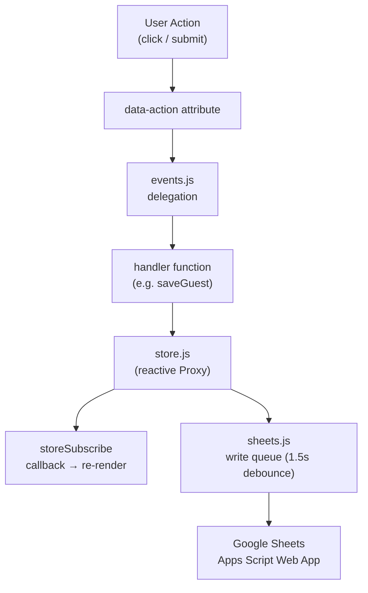

## Build

- **Vite 8** — entry `src/main.js`
- Manual chunks: `locale-en`, `chunk-public`, `chunk-analytics`, `chunk-gallery`
- Service Worker: `public/sw.js` with precache list
- Deploy: GitHub Pages via `dist/`

### Build Pipeline

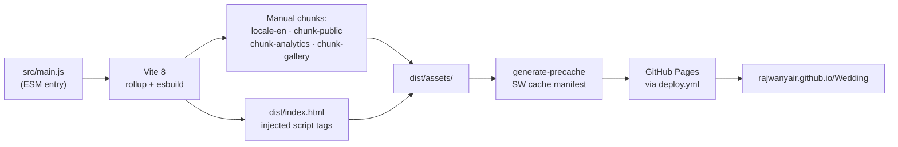

### Release Pipeline

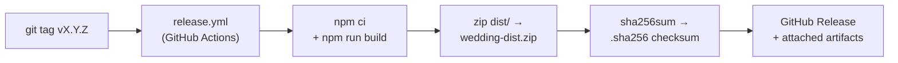

---

## Auth Flow (S4.1)

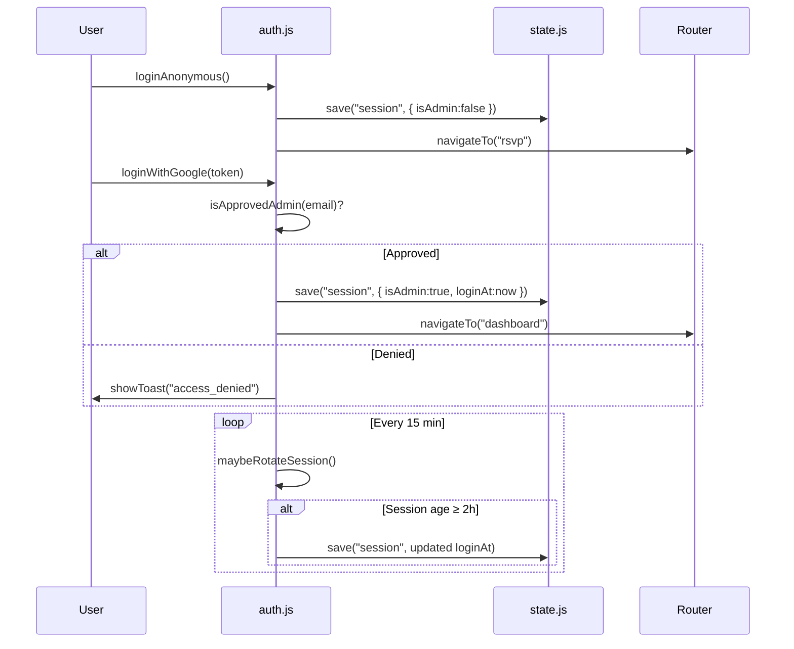

## RSVP Data Flow

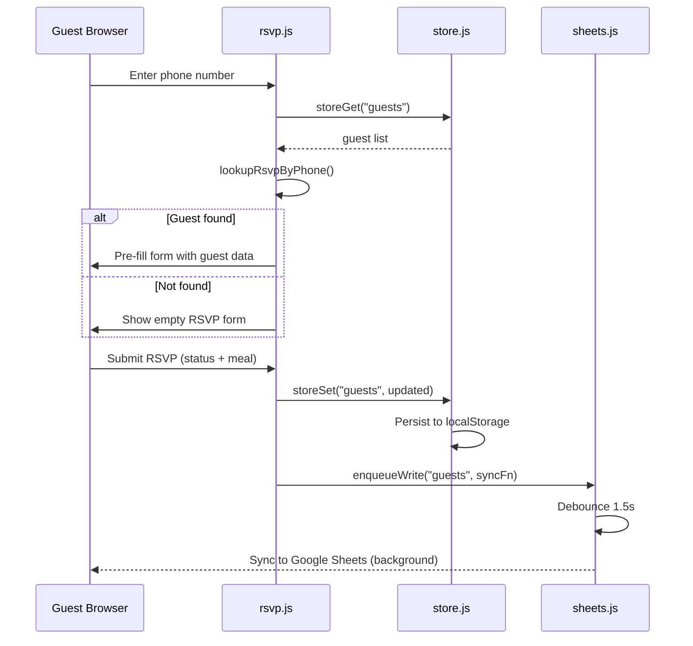

## Offline Sync Flow (S3.9)

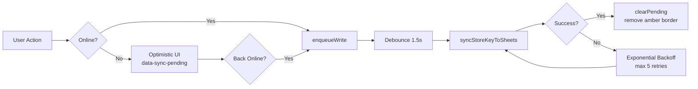

## Data Model (ER Diagram)

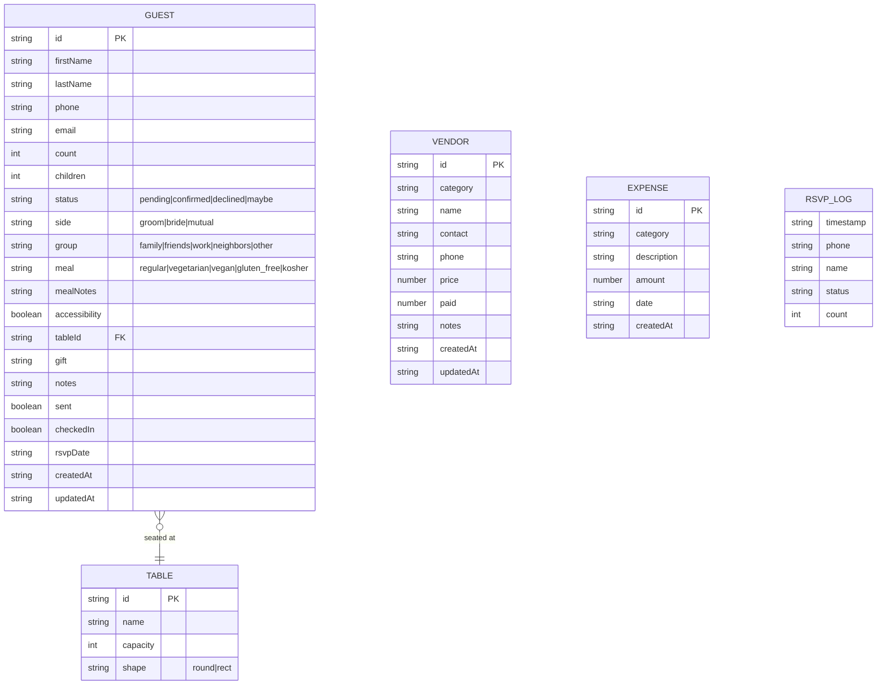

## CSS Layer Order

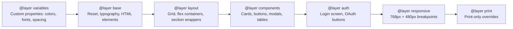

---

## Section Lifecycle (v11.1.0 — BaseSection)

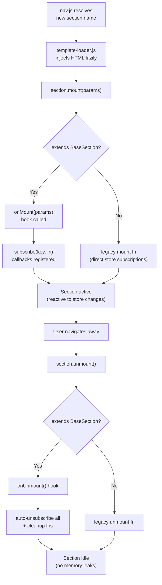

## Store Reactivity

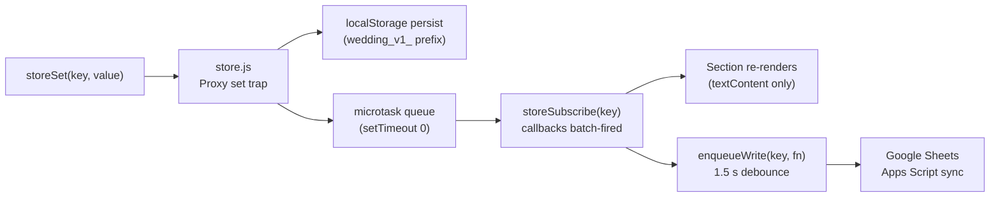

## Route Table (v11.1.0)

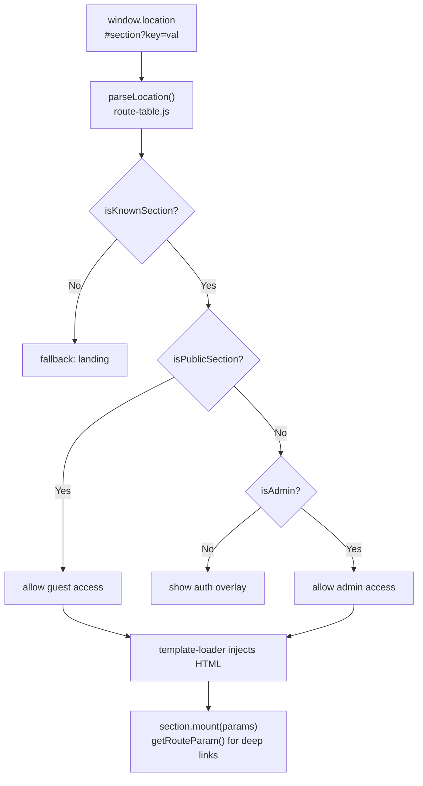

---

## Dead Export Audit (v10.1.0)

Run: `npm run audit:dead` via `scripts/dead-export-check.mjs`

| Metric | Value |
| ------ | ----- |
| Total exported symbols | 904 |
| Imported somewhere | 725 (80%) |
| Dead (no import found) | 179 (20%) |
| Files audited | 131 source files |

### Removed Aspirational Files

The following files were explicitly removed as aspirational with no active consumers:

| File | Version Removed | Justification |
| ---- | --------------- | ------------- |
| `src/services/donation-tracker.js` | v8.2.0 | No UI, no section, no activation plan |
| `src/services/vendor-proposals.js` | v8.2.0 | No UI, no section, no activation plan |
| `src/services/sms-service.js` | v8.2.0 | Redundant with WhatsApp path; no activation plan |
| `src/core/plugins.js` | v8.2.0 | Plugin system designed but never had real consumers |
| `src/utils/retry-policy.js` | v10.1.0 | Duplicate of retry-with-backoff.js; neither imported |
| `src/utils/retry-queue.js` | v10.1.0 | Persistent retry queue; no consumer |
| `src/utils/retry-with-backoff.js` | v10.1.0 | Duplicate of retry-policy.js; neither imported |
| `src/utils/form-builder.js` | v10.1.0 | Overlaps form-helpers.js (which is used); no consumer |
| `src/utils/form-validator.js` | v10.1.0 | Overlaps form-helpers.js; no consumer |
| `src/utils/form-metadata.js` | v10.1.0 | Overlaps form-builder.js; no consumer |
| `src/utils/event-bus.js` | v10.1.0 | Superseded by core/events.js; no consumer |
| `src/utils/event-emitter.js` | v10.1.0 | Superseded by core/events.js; no consumer |
| `src/utils/event-queue.js` | v10.1.0 | Superseded by core/events.js; no consumer |
| `src/utils/storage-helpers.js` | v10.1.0 | Superseded by core/storage.js; no consumer |
| `src/utils/storage-quota.js` | v10.1.0 | No consumer |
| `src/utils/number-formatter.js` | v10.1.0 | Re-exports currency.js; no direct consumer |
| `src/utils/number-helpers.js` | v10.1.0 | Generic math utils; no consumer |
| `src/utils/index.js` | v10.1.0 | Dead barrel; nothing imported it |

### Remaining Dead Exports

179 symbols have no `import` reference anywhere. They fall into three categories:

1. **Section analytics helpers** (e.g. `getCheckinRateByTable`, `getRsvpDailyTrend`) — exported for future dashboard wiring; retain
2. **Service utilities** (e.g. `logAdminAction`, `getClaims`) — exported for Supabase activation (v8.3+); retain
3. **Truly orphaned utilities** — quarterly review target; remove if no activation plan within 90 days

### v11.0.0 Dead Utils Purge

112 `src/utils/*.js` files were removed (along with 112 matching test files). Only 15 production-used utils
remain: `currency`, `date`, `form-helpers`, `guest-search`, `haptic`, `locale-detector`, `md-to-html`,
`message-templates`, `misc`, `orientation`, `phone`, `qr-code`, `rsvp-deadline`, `sanitize`, `undo`.

Categories removed: analytics/stats, lifecycle/state machines, validation chains, formatting pipelines, encryption/hashing, accessibility/animation/gesture, queue/cache/rate-limit/circuit-breaker, and unused barrels.

Re-run quarterly: `npm run audit:dead`
