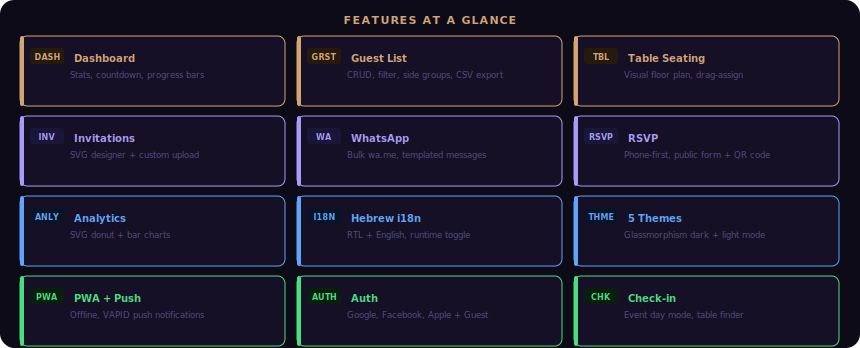
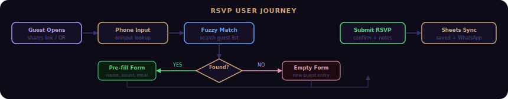

<div align="center">

# 💍 Wedding Manager

[](https://github.com/RajwanYair/Wedding/releases)
[](https://github.com/RajwanYair/Wedding/actions/workflows/ci.yml)
[](https://github.com/RajwanYair/Wedding/actions/workflows/deploy.yml)
[](https://github.com/RajwanYair/Wedding/actions)
[](https://nodejs.org)
[](docs/README.md)
[](LICENSE)
[](src/i18n/he.json)

**Wedding management app for RSVP, guest lists, table seating, WhatsApp outreach, and event-day operations.**
**Vite 8, vanilla JS/CSS, Hebrew RTL first, zero runtime dependencies.**

Node 22+ is the supported local and CI runtime.

</div>

---

## Features



## RSVP Journey



## Quick Start

```bash
git clone https://github.com/RajwanYair/Wedding.git
cd Wedding

# Install shared dependencies from the parent workspace
cd ../MyScripts && npm install && cd Wedding

# Start local development
npm run dev
```

## Development

```bash
npm run lint
npm test
npm run build
```

## Overview

```text
index.html        HTML shell
css/              layered stylesheets
src/main.js       bootstrap entry
src/core/         app primitives: store, nav, events, i18n, ui
src/sections/     feature modules with mount/unmount lifecycle
src/services/     auth, sheets, backend, presence, supabase
src/templates/    lazy-loaded section markup
src/modals/       lazy-loaded modal markup
tests/            Vitest + Playwright coverage
```

## Production Notes

- Runtime entry is `src/main.js`; feature UIs mount from `src/sections/` and lazy templates/modals under `src/templates/` and `src/modals/`
- User-facing strings are localized through `src/i18n/`; Hebrew is the default UI, English is the supported alternate UI toggle
- Data persists locally and can sync through the configured backend path; service worker assets live under `public/`
- CI expects `npm run lint`, `npm test`, and `npm run build` to stay green

## Docs

- [ARCHITECTURE.md](ARCHITECTURE.md): runtime structure, module boundaries, data flow
- [CONTRIBUTING.md](CONTRIBUTING.md): contributor workflow, testing rules, review checklist
- [CHANGELOG.md](CHANGELOG.md): release history and shipped changes
- [ROADMAP.md](ROADMAP.md): active production roadmap and upcoming priorities

Detailed runtime and data-model notes intentionally live outside the README so this file stays public-facing and production-relevant.

## Themes

| Name | CSS class | Primary color |
|------|-----------|---------------|
| Default | (none) | Purple `#8b5cf6` |
| Rose Gold | `theme-rosegold` | `#d4a574` |
| Gold | `theme-gold` | `#f59e0b` |
| Emerald | `theme-emerald` | `#10b981` |
| Royal Blue | `theme-royal` | `#3b82f6` |

## License

MIT © [RajwanYair](https://github.com/RajwanYair)
