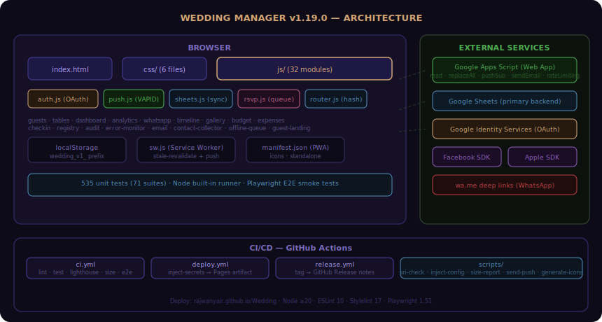

<div align="center">

# 💍 Wedding Manager


**Wedding management app — RSVP, table seating, WhatsApp invitations.**
**Modular (6 CSS + 17 JS), zero-dependency, Hebrew RTL with English support.**

</div>

---



## Features

| Feature | Description |
| --- | --- |
| 📊 **Dashboard** | Stats overview, countdown timer, progress bars, quick actions |
| 👥 **Guest List** | CRUD with side (groom/bride/mutual), meal preferences, accessibility, children |
| 🪑 **Table Seating** | Visual floor plan with round/rectangular tables, drag-and-drop assignment |
| 💌 **Invitation** | Auto-generated SVG invitation + custom JPG/PNG/SVG upload |
| 📱 **WhatsApp** | Templated messages with placeholders, bulk/individual send via wa.me |
| ✅ **RSVP** | Public-facing form for guest self-registration, auto-match existing |
| 📥 **Export** | CSV with UTF-8 BOM for Hebrew, print-friendly layout |
| 🌐 **i18n** | Full Hebrew/English support with language toggle |
| 🎨 **5 Themes** | Purple (default), Rose Gold, Classic Gold, Emerald, Royal Blue |
| 📲 **PWA** | Installable, offline-capable via Service Worker (stale-while-revalidate + 5-min update poll) |
| 🔐 **Auth** | Google (active) · Facebook · Apple · Anonymous guest (all optional) |

## Quick Start

```bash
# Clone
git clone https://github.com/RajwanYair/Wedding.git

# Open in browser (no build step needed!)
open index.html
```

## Auth Setup (optional)

Edit `js/config.js`:

```js
const GOOGLE_CLIENT_ID  = "YOUR_ID.apps.googleusercontent.com"; // console.cloud.google.com
const FB_APP_ID         = "";   // developers.facebook.com → App ID
const APPLE_SERVICE_ID  = "";   // developer.apple.com → Service ID
```

Add the SDK `<script>` tags for Facebook and Apple in `index.html` (see comments in that file).

## Development

```bash
# Tests
node --test tests/wedding.test.mjs

# Lint — all must exit 0 (0 errors, 0 warnings)
npm run lint         # HTML + CSS + JS + Markdown
npm run lint:html    # HTMLHint    → index.html
npm run lint:css     # Stylelint   → css/*.css
npm run lint:js      # ESLint      → js/*.js
npm run lint:md      # markdownlint-cli2
```

## Project Structure

```text
Wedding/
├── index.html            # HTML shell (links css/ and js/)
├── css/                  # 6 CSS modules
│   ├── variables.css     # Custom properties, theme colors
│   ├── base.css          # Reset, typography
│   ├── layout.css        # Grid, nav, panels
│   ├── components.css    # Buttons, forms, cards, modals
│   ├── responsive.css    # 768px + 480px breakpoints
│   └── auth.css          # Auth overlay
├── js/                   # 17 JS modules
│   ├── config.js         # App constants, version, auth credentials
│   ├── i18n.js           # Hebrew + English strings
│   ├── dom.js            # Cached DOM refs (el object)
│   ├── state.js          # App state (_guests, _tables, _weddingInfo)
│   ├── utils.js          # cleanPhone, date helpers
│   ├── ui.js             # Toast, modal, loading, i18n apply
│   ├── nav.js            # Tab navigation
│   ├── dashboard.js      # Stats, countdown, progress
│   ├── guests.js         # Guest CRUD, filter, sort, export
│   ├── tables.js         # Table floor plan, seating
│   ├── invitation.js     # SVG invitation generator
│   ├── whatsapp.js       # Message templates, wa.me bulk send
│   ├── rsvp.js           # Public RSVP form
│   ├── settings.js       # Wedding info, theme, language
│   ├── sheets.js         # Google Sheets sync
│   ├── auth.js           # Google / Facebook / Apple / Anonymous auth
│   └── app.js            # Entry point, init, SW registration
├── sw.js                 # Service Worker (stale-while-revalidate, 5-min update poll)
├── manifest.json         # PWA manifest
├── icon.svg              # App icon (512×512)
├── invitation.jpg        # Default invitation background
├── architecture.svg      # Architecture diagram
├── package.json          # devDeps: eslint, stylelint, htmlhint, markdownlint-cli2
├── tests/
│   └── wedding.test.mjs  # 125 unit tests (Node built-in runner)
└── .github/              # Copilot instructions, agents, prompts, CI/CD workflows
```

## Guest Model (v1.1.0)

```text
{ id, firstName, lastName, phone, email, count, children,
  status: pending|confirmed|declined|maybe,
  side:   groom|bride|mutual,
  group:  family|friends|work|other,
  meal:   regular|vegetarian|vegan|gluten_free|kosher,
  mealNotes, accessibility: boolean,
  tableId, gift, notes, sent, rsvpDate, createdAt, updatedAt }
```

## Themes

| Theme | Accent Color |
| --- | --- |
| Default Purple | `#d4a574` — elegant gold on dark purple |
| Rose Gold | `#e8a0b4` — warm pink tones |
| Classic Gold | `#d4a030` — traditional gold |
| Emerald | `#6ee7b7` — fresh green |
| Royal Blue | `#60a5fa` — cool blue |

## License

MIT © [RajwanYair](https://github.com/RajwanYair)
