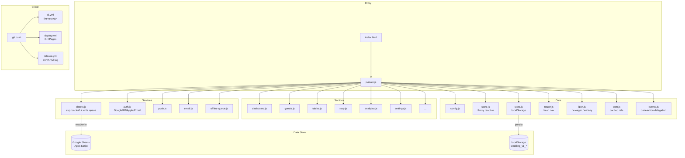

<div align="center">

# 💍 Wedding Manager


**Wedding management app — RSVP, table seating, WhatsApp invitations, push notifications, E2E tests.**
**Modular (7 CSS + 38 JS), zero-dependency, Hebrew RTL with English support.**

</div>

---


## Features


## RSVP Journey


## Quick Start

```bash
# Clone
git clone https://github.com/RajwanYair/Wedding.git

# Install shared dependencies (from parent directory)
cd .. && npm install && cd Wedding

# Open in browser (no build step needed!)
open index.html
```

## Auth Setup (optional)


Edit `js/config.js`:

```js
const GOOGLE_CLIENT_ID  = "YOUR_ID.apps.googleusercontent.com"; // console.cloud.google.com
const FB_APP_ID         = "";   // developers.facebook.com → App ID
const APPLE_SERVICE_ID  = "";   // developer.apple.com → Service ID
```

Add SDK `<script>` tags for Facebook and Apple in `index.html` (see comments).

## Development

```bash
# Tests
npm test

# Lint — all must exit 0 (0 errors, 0 warnings)
npm run lint         # HTML + CSS + JS + Markdown
npm run lint:html    # HTMLHint    → index.html
npm run lint:css     # Stylelint   → css/*.css
npm run lint:js      # ESLint      → js/*.js
npm run lint:md      # markdownlint-cli2
```

## Project Structure

```text
Wedding/
├── index.html            # HTML shell (links css/ and js/)
├── css/                  # 7 CSS modules
│   ├── variables.css     # Custom properties, theme colors
│   ├── base.css          # Reset, typography
│   ├── layout.css        # Grid, nav, panels
│   ├── components.css    # Buttons, forms, cards, modals
│   ├── responsive.css    # 768px + 480px breakpoints
│   ├── print.css         # Print styles
│   └── auth.css          # Auth overlay
├── js/                   # 38 JS modules
│   ├── config.js         # App constants, version, auth credentials
│   ├── i18n.js           # Hebrew + English strings
│   ├── dom.js            # Cached DOM refs (el object)
│   ├── store.js          # Proxy-based reactive store with debounced persist
│   ├── state.js          # App state (_guests, _tables, _weddingInfo)
│   ├── utils.js          # cleanPhone, sanitize(), date helpers
│   ├── ui.js             # Toast (stacking+progress), modal, loading, i18n apply
│   ├── nav.js            # Tab navigation + swipe gestures + View Transitions
│   ├── router.js         # Hash router (replaceState, back/forward)
│   ├── dashboard.js      # Stats (IntersectionObserver), countdown, progress
│   ├── guests.js         # Guest CRUD, filter, sort, export
│   ├── tables.js         # Table floor plan, seating
│   ├── invitation.js     # SVG invitation generator
│   ├── whatsapp.js       # Message templates, wa.me bulk send
│   ├── rsvp.js           # Public RSVP form (phone-first lookup)
│   ├── settings.js       # Wedding info, theme, language
│   ├── sheets.js         # Google Sheets sync (exp. backoff, write queue)
│   ├── auth.js           # Google / Facebook / Apple / Anonymous auth
│   ├── vendors.js        # Vendor CRUD + payment tracking
│   ├── expenses.js       # Expense tracking
│   ├── budget.js         # Budget overview
│   ├── analytics.js      # SVG donut + bar charts
│   ├── audit.js          # Audit log
│   ├── error-monitor.js  # Client error capture
│   ├── push.js           # Web Push notifications
│   ├── email.js          # Email notifications via Apps Script
│   └── app.js            # Entry point, init, SW registration
├── sw.js                 # Service Worker (stale-while-revalidate, 5-min update poll)
├── manifest.json         # PWA manifest
├── package.json          # devDeps; shared node_modules in ../MyScripts/
├── tests/
│   ├── wedding.test.mjs  # 772+ unit tests (Vitest — 83+ suites)
│   └── e2e/              # Playwright smoke + RSVP + navigation + a11y
└── .github/              # Copilot instructions, agents, CI/CD workflows

```

## Architecture



## Guest Model (v1.1.0)

```text
{ id, firstName, lastName, phone, email, count, children,
  status: pending|confirmed|declined|maybe,
  side:   groom|bride|mutual,
  group:  family|friends|work|other,
  meal:   regular|vegetarian|vegan|gluten_free|kosher,
  mealNotes, accessibility: boolean,
  tableId, gift, notes, sent, rsvpDate, createdAt, updatedAt }
```

## Themes

| Name | CSS class | Primary color |
|------|-----------|---------------|
| Default | (none) | Purple `#8b5cf6` |
| Rose Gold | `theme-rosegold` | `#d4a574` |
| Gold | `theme-gold` | `#f59e0b` |
| Emerald | `theme-emerald` | `#10b981` |
| Royal Blue | `theme-royal` | `#3b82f6` |

## License

MIT © [RajwanYair](https://github.com/RajwanYair)

---

## User Guide

### Dashboard

The **Dashboard** is the first tab after login. It shows countdown, confirmed/pending/declined counts, total seats, suggested actions, and gift tracker. Stats animate on scroll.

### Managing Guests

1. Click **הוסף אורח / Add Guest** (+ button).
2. Fill in first name, last name, phone, and group.
3. Set expected attendance count (adults + children).
4. Click **שמור / Save**.

Use the filter bar for Status, Side, Group, or free-text search. Click column headers to sort. An amber border indicates unsynced data.

### Table Seating

Create tables with name, capacity, and shape. Use **שבץ אוטומטית / Auto-assign** to seat all unassigned confirmed guests by group priority, or drag guests manually.

### RSVP Flow

Guests open the app link, enter their phone number (phone-first lookup), confirm/decline, select meal preference, and submit. Generate QR codes from the Invitation tab.

### WhatsApp Messages

Select guests and click the WhatsApp icon (💬). Phone numbers are auto-converted to `+972` international format via `wa.me/` links.

### Vendors & Budget

Add vendors with category, name, contact, price, and paid amount. The Budget tab shows total cost, paid amount, remaining balance, and category breakdown. Log ad-hoc expenses separately.

### Settings & Offline Mode

The app works offline once loaded. Data is saved to localStorage and syncs to Google Sheets when online. Configure backend settings, themes, and language in Settings.
