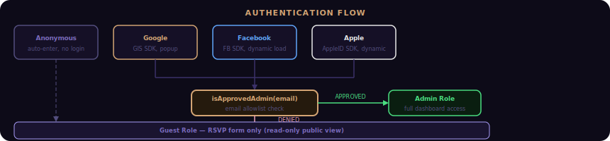
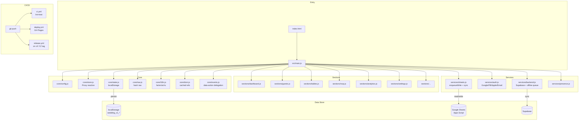

<div align="center">

# 💍 Wedding Manager


**Wedding management app for RSVP, guest lists, table seating, WhatsApp outreach, and event-day operations.**
**Vite 8, vanilla JS/CSS, Hebrew RTL first, zero runtime dependencies.**

Node 22+ is the supported local and CI runtime.

</div>

---


## Features


## RSVP Journey


## Quick Start

```bash
git clone https://github.com/RajwanYair/Wedding.git
cd Wedding

# Install shared dependencies from the parent workspace
cd ../MyScripts && npm install && cd Wedding

# Start local development
npm run dev
```

## Development

```bash
npm run lint
npm test
npm run build
```

## Auth Setup (optional)



Edit `src/core/config.js`:

```js
const GOOGLE_CLIENT_ID  = "YOUR_ID.apps.googleusercontent.com"; // console.cloud.google.com
const FB_APP_ID         = "";   // developers.facebook.com → App ID
const APPLE_SERVICE_ID  = "";   // developer.apple.com → Service ID
```

Add SDK `<script>` tags for Facebook and Apple in `index.html` (see comments).

## Overview

```text
index.html        HTML shell
css/              layered stylesheets
src/main.js       bootstrap entry
src/core/         app primitives: store, nav, events, i18n, ui
src/sections/     feature modules with mount/unmount lifecycle
src/services/     auth, sheets, backend, presence, supabase
src/templates/    lazy-loaded section markup
src/modals/       lazy-loaded modal markup
tests/            Vitest + Playwright coverage
```

Detailed runtime notes live in ARCHITECTURE.md. Contributor workflow notes live in CONTRIBUTING.md.

## Architecture



## Guest Model

```text
{ id, firstName, lastName, phone, email, count, children,
  status: pending|confirmed|declined|maybe,
    side: groom|bride|mutual,
    group: family|friends|work|neighbors|other,
    meal: regular|vegetarian|vegan|gluten_free|kosher,
    mealNotes, accessibility, transport, tableId, gift, notes,
    sent, checkedIn, rsvpDate, createdAt, updatedAt }
```

## Themes

| Name | CSS class | Primary color |
|------|-----------|---------------|
| Default | (none) | Purple `#8b5cf6` |
| Rose Gold | `theme-rosegold` | `#d4a574` |
| Gold | `theme-gold` | `#f59e0b` |
| Emerald | `theme-emerald` | `#10b981` |
| Royal Blue | `theme-royal` | `#3b82f6` |

## License

MIT © [RajwanYair](https://github.com/RajwanYair)

---

## User Guide

### Dashboard

The **Dashboard** is the first tab after login. It shows countdown, confirmed/pending/declined counts, total seats, suggested actions, and gift tracker. Stats animate on scroll.

### Managing Guests

1. Click **הוסף אורח / Add Guest** (+ button).
2. Fill in first name, last name, phone, and group.
3. Set expected attendance count (adults + children).
4. Click **שמור / Save**.

Use the filter bar for Status, Side, Group, or free-text search. Click column headers to sort. An amber border indicates unsynced data.

### Table Seating

Create tables with name, capacity, and shape. Use **שבץ אוטומטית / Auto-assign** to seat all unassigned confirmed guests by group priority, or drag guests manually.

### RSVP Flow

Guests open the app link, enter their phone number (phone-first lookup), confirm/decline, select meal preference, and submit. Generate QR codes from the Invitation tab.

### WhatsApp Messages

Select guests and click the WhatsApp icon (💬). Phone numbers are auto-converted to `+972` international format via `wa.me/` links.

### Vendors & Budget

Add vendors with category, name, contact, price, and paid amount. The Budget tab shows total cost, paid amount, remaining balance, and category breakdown. Log ad-hoc expenses separately.

### Settings & Offline Mode

The app works offline once loaded. Data is saved to localStorage and syncs to Google Sheets when online. Configure backend settings, themes, and language in Settings.
