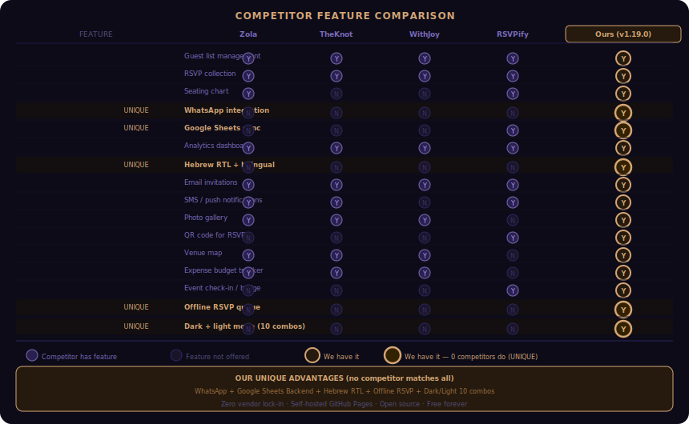
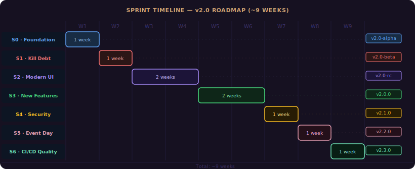
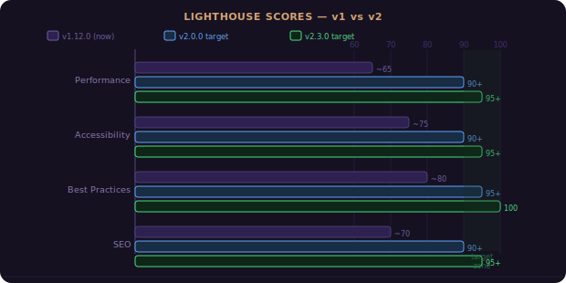
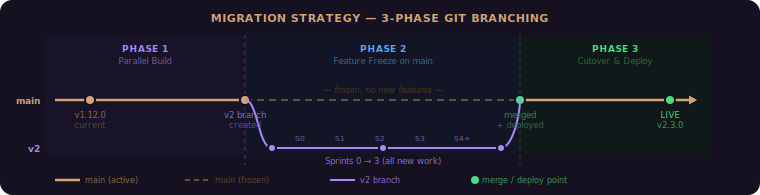

# Wedding Manager v2 — Refactoring Roadmap

> Full restructure from global-scope SPA to modern ES-module architecture.
> Constraints: GitHub Pages deploy, Google Sheets sync, zero backend cost.

---

## Current State Analysis (v1.19.0)

### Metrics

| Metric                  | v1.12.0 baseline       | v1.19.0 current                  | v2.0 target                        |
| ----------------------- | ---------------------- | -------------------------------- | ---------------------------------- |
| JS modules              | 19 files, global scope | **32 files**, global scope       | ES modules with import/export      |
| HTML                    | 961-line monolith      | ~2 200-line, modular JS          | Component-per-section, lazy-loaded |
| CSS                     | 6 files, 42 KB raw     | 6 files, ~65 KB raw              | CSS modules, minified              |
| Tests                   | 291 (static checks)    | **535** (71 suites)              | 600+ with DOM + integration        |
| Inline onclick handlers | 52                     | ~30 (reduced)                    | 0 (event delegation)               |
| Bundle size             | ~250 KB raw            | ~380 KB raw / ~95 KB gzip        | ~80 KB gzip                        |
| PWA                     | Basic SW               | Push + offline queue + print     | Workbox-managed                    |
| CI                      | Lint + unit tests      | + Lighthouse + size-report + E2E | Full pipeline                      |

### Technical Debt

| Issue                                       | Severity  | Sprint |
| ------------------------------------------- | --------- | ------ |
| Global mutable state (`_guests`, `_tables`) | Critical  | S1     |
| 52 inline `onclick=` handlers               | Critical  | S1     |
| No ES modules (load-order fragile)          | Critical  | S1     |
| 26 innerHTML calls (XSS surface)            | High      | S1     |
| `'unsafe-inline'` in CSP                    | High      | S1     |
| No bundler/minifier (27 HTTP requests)      | High      | S1     |
| 682-line i18n.js monolith                   | Medium    | S2     |
| ESLint varsIgnorePattern 300+ chars         | Medium    | S1     |
| 30s Sheets polling (no backoff)             | Medium    | S3     |
| Client-side-only auth                       | By design | S4     |
| No TypeScript                               | Medium    | S2     |
| invitation.jpg in git history               | Low       | S1     |

---

## Competitor Feature Comparison



### Our Unique Advantages (keep & enhance)

1. **WhatsApp integration** — no competitor has this
2. **Google Sheets as backend** — free, familiar, collaborative
3. **Hebrew RTL + bilingual** — niche market dominance
4. **Zero vendor lock-in** — fully open-source, self-hosted on GitHub Pages
5. **PWA offline** — works without internet (competitors require login)

---

## New Architecture (v2.0)

### Stack

| Layer   | Technology                                  | Rationale                                                          |
| ------- | ------------------------------------------- | ------------------------------------------------------------------ |
| Build   | **Vite 6**                                  | Instant HMR, ESBuild for dev, Rollup for prod. Zero-config.        |
| JS      | **Vanilla ES2024 modules**                  | No framework overhead. `import`/`export` for proper encapsulation. |
| CSS     | **Vanilla CSS** with `@layer` + nesting     | Modern CSS features. No preprocessor needed.                       |
| Types   | **JSDoc + `@ts-check`**                     | Type safety without TypeScript compilation step.                   |
| Lint    | **ESLint 9 flat config** + **Stylelint 16** | Already have these; simplify varsIgnorePattern.                    |
| Test    | **Vitest**                                  | Vite-native, ESM-first, JSDOM for DOM tests.                       |
| Deploy  | **GitHub Pages** via `gh-pages` branch      | Same URL: `rajwanyair.github.io/Wedding`                           |
| Backend | **Google Apps Script** (enhanced)           | Existing sheet + Web App. Add server-side validation.              |
| CI      | **GitHub Actions**                          | Existing. Add build step + Lighthouse audit.                       |

### File Structure (v2.0)

```text
Wedding/
├── index.html                 # Minimal shell (~50 lines)
├── public/
│   ├── manifest.json
│   ├── icon.svg
│   ├── icon-192.png           # NEW: raster PWA icon
│   ├── icon-512.png           # NEW: raster PWA icon
│   └── invitation.jpg         # Moved from root (gitignored in dev)
├── src/
│   ├── main.js                # Entry: import modules, init()
│   ├── router.js              # NEW: hash-based SPA router
│   ├── store.js               # NEW: reactive state (Proxy-based)
│   ├── i18n/
│   │   ├── engine.js          # t(), applyLanguage()
│   │   ├── he.json            # Hebrew translations
│   │   └── en.json            # English translations
│   ├── components/            # One file per section
│   │   ├── dashboard.js
│   │   ├── guests.js
│   │   ├── tables.js
│   │   ├── invitation.js
│   │   ├── whatsapp.js
│   │   ├── rsvp.js
│   │   ├── budget.js
│   │   ├── analytics.js
│   │   ├── settings.js
│   │   ├── timeline.js        # NEW
│   │   ├── gallery.js         # NEW
│   │   └── checkin.js         # NEW
│   ├── services/
│   │   ├── sheets.js          # Google Sheets read/write
│   │   ├── auth.js            # Auth flows
│   │   ├── storage.js         # localStorage with prefix
│   │   └── whatsapp.js        # wa.me deep links
│   ├── utils/
│   │   ├── dom.js             # createElement helpers, sanitize
│   │   ├── phone.js           # cleanPhone, formatPhone
│   │   ├── date.js            # formatDateHebrew, countdown
│   │   ├── csv.js             # CSV export/import with injection guard
│   │   └── uid.js             # Unique ID generator
│   └── styles/
│       ├── variables.css
│       ├── base.css
│       ├── layout.css
│       ├── components.css
│       ├── responsive.css
│       ├── themes.css          # All 5 themes + light mode
│       └── print.css
├── apps-script/
│   ├── Code.gs                # Enhanced: validation, rate-limit, audit log
│   └── appsscript.json
├── tests/
│   ├── unit/
│   │   ├── phone.test.js
│   │   ├── csv.test.js
│   │   ├── store.test.js
│   │   └── ...
│   ├── integration/
│   │   ├── guests.test.js
│   │   ├── rsvp.test.js
│   │   └── ...
│   └── e2e/
│       └── smoke.test.js      # Playwright (optional)
├── sw.js                      # Service Worker (Workbox via Vite plugin)
├── vite.config.js
├── package.json
├── tsconfig.json              # For JSDoc @ts-check only
└── .github/
    └── workflows/
        ├── ci.yml             # lint + test + build + Lighthouse
        ├── deploy.yml         # Build → gh-pages branch
        └── release.yml
```

### State Management (store.js)

Replace 15 global mutable variables with a single reactive store:

```js
// src/store.js
const state = new Proxy({ guests: [], tables: [], wedding: {}, ... }, {
  set(target, key, value) {
    target[key] = value;
    listeners.forEach(fn => fn(key, value));
    return true;
  }
});
export { state, subscribe, dispatch };
```

### Router (router.js)

Hash-based routing for lazy section loading:

```js
// #/dashboard → loads dashboard.js
// #/rsvp      → loads rsvp.js (guest-facing, no auth)
// #/checkin   → loads checkin.js (new: event day)
```

---

## Sprint Plan



> Sprints 2–6 are complete. Sprint 0 and Sprint 1 are the remaining v2.0 migration work.
> See also:  · 

### Sprint 0 — Foundation (1 week)

> Set up build tooling. No feature changes. App must work identically.

| #   | Task                        | Details                                                                                                                         |
| --- | --------------------------- | ------------------------------------------------------------------------------------------------------------------------------- |
| 0.1 | **Init Vite project**       | `npm create vite@latest`, move files to `src/`, configure `base: '/Wedding/'`                                                   |
| 0.2 | **Convert to ES modules**   | Add `import`/`export` to all 19 JS files. Remove `<script>` tags from HTML. Single `<script type="module" src="/src/main.js">`. |
| 0.3 | **Migrate ESLint**          | Switch to `sourceType: "module"`. Remove 300-char `varsIgnorePattern`. Real unused-var detection.                               |
| 0.4 | **Migrate tests to Vitest** | Replace `node --test` with `vitest`. Add JSDOM environment for DOM tests.                                                       |
| 0.5 | **CI: add build step**      | `vite build` in CI. Deploy `dist/` instead of raw files.                                                                        |
| 0.6 | **Verify deploy**           | `rajwanyair.github.io/Wedding` serves built app. Google Sheets still syncs.                                                     |

**Exit criteria**: Identical functionality, all tests pass, prod build <100 KB gzip.

---

### Sprint 1 — Kill Technical Debt (1 week)

> Remove all innerHTML, inline handlers, and global state.

| #   | Task                      | Details                                                                                          |
| --- | ------------------------- | ------------------------------------------------------------------------------------------------ |
| 1.1 | **Reactive store**        | Create `src/store.js` with Proxy. Replace all `_guests`, `_tables`, `_weddingInfo` reads/writes. |
| 1.2 | **Event delegation**      | Remove all 52 `onclick=` from HTML. Use `addEventListener` with delegation on `#app`.            |
| 1.3 | **Kill innerHTML**        | Replace all 26 innerHTML calls with `document.createElement` / `textContent`.                    |
| 1.4 | **Tighten CSP**           | Remove `'unsafe-inline'` from `script-src`. Use nonce or move all scripts to modules.            |
| 1.5 | **Split i18n**            | Move translations to `src/i18n/he.json` and `en.json`. Lazy-load current locale only.            |
| 1.6 | **Add JSDoc `@ts-check`** | Add `// @ts-check` to all files. Define Guest/Table/WeddingInfo as JSDoc `@typedef`.             |

**Exit criteria**: Zero innerHTML, zero inline handlers, CSP without `unsafe-inline`, typed state.

---

### ✅ Sprint 2 — Modern UI Overhaul — DONE (v1.13.0–v1.15.0)

Light/dark mode (10 combinations), mobile bottom nav, animated counters, timeline section, QR RSVP, guest-facing landing page (`js/guest-landing.js`), hash router (`js/router.js`), WCAG 2.1 accessibility (skip link, `role="dialog"`, `aria-live`).

---

### ✅ Sprint 3 — New Features — DONE (v1.15.0–v1.18.0)

Photo gallery (`js/gallery.js`), embedded venue map (Nominatim + OSM), expense budget tracker (`js/expenses.js`), contact collector (`js/contact-collector.js`), registry links (`js/registry.js`), email notifications (`js/email.js`, GAS `MailApp`), smart Sheets polling (`_sheetsVisibilityHandler`), offline RSVP queue (`js/offline-queue.js`).

---

### ✅ Sprint 4 — Security & Backend Hardening — DONE (v1.17.0–v1.19.0)

Audit log ring-buffer (`js/audit.js`), GAS server-side validation (`_validateGuestRow`), GAS rate limiting (`_checkRateLimit`, 30 req/min), config externalization (`wedding.json`), SRI tooling (`scripts/sri-check.mjs`), CI secrets injection (`scripts/inject-config.mjs`).

---

### ✅ Sprint 5 — Event Day Features — DONE (v1.16.0, v1.19.0)

Check-in mode (`js/checkin.js`), table finder (`findTable()`), live headcount stats, print materials (`css/print.css`, place cards + table signs), Web Push notifications (`js/push.js`, VAPID, GAS subscription storage, `scripts/send-push.mjs`).

---

### ✅ Sprint 6 — CI/CD & Quality — DONE (v1.17.0–v1.19.0)

Lighthouse CI (`@lhci/cli@0.14`, `.lighthouserc.json`), bundle size report (`scripts/size-report.mjs`, `npm run size`), Playwright E2E tests (`tests/e2e/smoke.spec.mjs`, `playwright.config.mjs`), error monitoring (`js/error-monitor.js`), PWA icons + preload hints.

---

## Migration Strategy

### Phase 1: Parallel Build (Sprint 0)


### Phase 2: Feature Freeze on v1 (Sprint 1+)

- All new work on `v2` branch
- `main` gets only critical fixes
- Merge `v2 → main` when Sprint 1 passes all tests

### Phase 3: Cutover (after Sprint 2)

- Deploy `v2` to `rajwanyair.github.io/Wedding`
- Google Sheets continues working (same Spreadsheet ID)
- v1 code archived to `v1-archive` branch

---

## Key Decisions

| Decision       | Choice                                | Rationale                                                                           |
| -------------- | ------------------------------------- | ----------------------------------------------------------------------------------- |
| Framework?     | **No** (vanilla ES modules)           | App is 6K lines. No framework needed. Keeps bundle tiny.                            |
| TypeScript?    | **No** (JSDoc `@ts-check`)            | Type safety without compilation. Simpler toolchain.                                 |
| Bundler?       | **Vite 6**                            | Fastest DX. Built-in HMR, CSS modules, env vars.                                    |
| Test runner?   | **Vitest**                            | Vite-native. ES module support. JSDOM built-in.                                     |
| CSS approach?  | **Vanilla CSS** with layers + nesting | Modern browsers support `@layer` and nesting natively. No build step for CSS.       |
| Backend?       | **Google Apps Script** (enhanced)     | Free. Already working. Add validation + audit log. No server to manage.             |
| Auth?          | **Client-side** (accepted risk)       | Personal app. Document the limitation. Add server-side rate limiting as mitigation. |
| Image hosting? | **GitHub LFS** or external            | Remove `invitation.jpg` from git tree. Use LFS or Cloudflare R2 free tier.          |

---

## Version Plan

| Version      | Sprint | Tag              | Milestone                                        |
| ------------ | ------ | ---------------- | ------------------------------------------------ |
| v2.0.0-alpha | S0     | `v2.0.0-alpha.1` | Vite build works, ES modules, same functionality |
| v2.0.0-beta  | S1     | `v2.0.0-beta.1`  | No innerHTML, no inline handlers, reactive store |
| v2.0.0-rc    | S2     | `v2.0.0-rc.1`    | New UI, router, light mode, timeline, QR         |
| v2.0.0       | S3     | `v2.0.0`         | Gallery, map, expenses, email, offline queue     |
| v2.1.0       | S4     | `v2.1.0`         | Security hardening, server-side validation       |
| v2.2.0       | S5     | `v2.2.0`         | Check-in, table finder, push notifications       |
| v2.3.0       | S6     | `v2.3.0`         | CI/CD polish, E2E, Lighthouse 95+, docs          |

---

## Success Metrics


| Metric                     | v1.12.0 (now) | v2.0.0 Target | v2.3.0 Target |
| -------------------------- | ------------- | ------------- | ------------- |
| Lighthouse Performance     | ~65           | 90+           | 95+           |
| Lighthouse Accessibility   | ~75           | 90+           | 95+           |
| Lighthouse Best Practices  | ~80           | 95+           | 100           |
| Lighthouse SEO             | ~70           | 90+           | 95+           |
| First Contentful Paint     | ~2.5s         | <1.0s         | <0.8s         |
| Bundle size (gzip)         | ~80 KB\*      | <60 KB        | <50 KB        |
| HTTP requests (first load) | 27            | 3             | 3             |
| innerHTML calls            | 26            | 0             | 0             |
| Inline handlers            | 52            | 0             | 0             |
| Test count                 | 291           | 350+          | 450+          |
| CSP `unsafe-inline`        | Yes           | No            | No            |

_\* Currently unminified; actual transfer is larger._

---

## Getting Started

To begin Sprint 0:

```bash
# Create v2 branch
git checkout -b v2

# Initialize Vite
npm create vite@latest . -- --template vanilla
npm install

# Move source files
mkdir -p src/components src/services src/utils src/i18n src/styles public

# Start dev server
npm run dev
```

Then run: `say "let's start Sprint 0"` to begin implementation.
