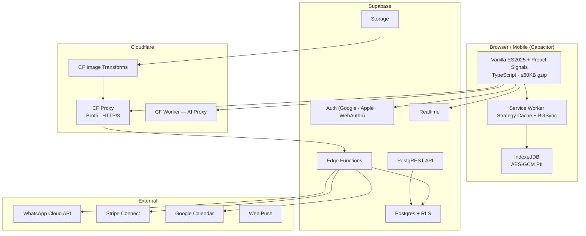

# Wedding Manager — Production Roadmap v33.0.0

> Architecture: [ARCHITECTURE.md](ARCHITECTURE.md) · History: [CHANGELOG.md](CHANGELOG.md) ·
> Contributors: [CONTRIBUTING.md](CONTRIBUTING.md) · ADRs: [docs/adr/](docs/adr/) ·
> Operations: [docs/operations/](docs/operations/)

---

## Contents

1. [Executive Summary](#1-executive-summary)
2. [Current State (v32.2.0)](#2-current-state-v3220)
3. [Deep Decision Rethink — Every Layer](#3-deep-decision-rethink--every-layer)
4. [Competitive Landscape — Best-in-Class Comparison](#4-competitive-landscape--best-in-class-comparison)
5. [Harvested Best Practices](#5-harvested-best-practices)
6. [Honest Audit — What's Right & Wrong](#6-honest-audit--whats-right--wrong)
7. [Technical Debt & Risk Register](#7-technical-debt--risk-register)
8. [Improve / Rewrite / Refactor / Enhance](#8-improve--rewrite--refactor--enhance)
9. [Phased Plan v33 → v37](#9-phased-plan-v33--v37)
10. [Sprint Backlog](#10-sprint-backlog)
11. [Architecture Target State (v37)](#11-architecture-target-state-v37)
12. [Cost & Self-Hosting Profile](#12-cost--self-hosting-profile)
13. [Success Metrics & SLOs](#13-success-metrics--slos)
14. [Open Decisions Register](#14-open-decisions-register)
15. [Operational Methodology](#15-operational-methodology)
16. [Working Principles](#16-working-principles)
17. [Release Line](#17-release-line)
18. [Sealed Decisions (v0 → v32.2)](#18-sealed-decisions-v0--v322)

---

## 1. Executive Summary

### North Star

*The fastest, most accessible, RTL-native, offline-first, open-source wedding manager on the web.
Self-hostable in one click. Operable on flaky 3G in Hebrew. Integrated end-to-end with WhatsApp.
Planner-grade analytics. AI-optional, privacy-first. $0/month self-hosted. Best-in-class DX.*

### State (2026-06-05, v32.2.0)

| Metric | Value | Health |
| --- | --- | --- |
| Tests | 6894 across 489 files | ✅ |
| Sections | 24 (mount/unmount lifecycle) | ✅ |
| Core modules | 33 | ✅ |
| Utilities | 190 | ⚠️ Critical sprawl |
| Repositories | 11 (mandatory data path) | ✅ |
| Handlers | 7 | ✅ |
| Locales | 6 (HE · EN · AR · FR · ES · RU) | ✅ |
| Supabase migrations | 26 | ✅ |
| Edge functions | 13 | ✅ |
| Bundle | ~50 KB gzip (gate ≤ 60 KB) | ✅ |
| Lint | 0 errors, 0 warnings | ✅ |
| Mobile | PWA + Capacitor scaffold | ⚠️ |
| Public API | None | ❌ |
| AI | Adapters + proxy deployed; UI partial | ⚠️ |

### 7 Highest-Leverage Decisions This Cycle

1. **Production readiness** — resolve all warnings, remove dead code/configs, ensure zero
   suppressions or workarounds. Ship-ready at every commit.
2. **TypeScript for all new files** — 0 TSC errors achieved. Graduate from JSDoc.
3. **Halt utility sprawl** — 190 files is unsustainable. Freeze new utils. Audit, merge, delete.
   Hard CI gate at ≤ 120.
4. **Wire ALL built features into UI** — "Built ≠ Done." Every feature must have a UI surface.
5. **Ship Capacitor to App Store + Play Store** — scaffold exists; signing + distribution remaining.
6. **Public REST API via PostgREST** — unlock integrations, third-party apps, plugin ecosystem.
7. **Consolidate architecture** — kill the "util-per-sprint" pattern. Domain-group modules.

### Top 3 Unique Advantages (Defend at All Costs)

1. **Bundle ≤ 60 KB gzip** — 5–10× smaller than every competitor. Hard CI gate, immutable.
2. **WhatsApp-native + WABA Cloud API** — only wedding app with bulk + webhooks + scheduling.
3. **MIT + self-hostable + offline-first + RTL-first** — privacy, portability, locale moat.

### Top 3 Honest Weaknesses (Fix Now)

1. **190 utilities with incomplete UI wiring** — over-engineering disguised as velocity.
2. **No TypeScript** — JSDoc + `types.d.ts` is fragile at scale; refactoring is unsafe.
3. **Suspended configs removed** — LiveServer, webhint, and all IE-targeting noise eliminated from
   VS Code workspace; extensions.json cleaned; DX fully production-clean.

---

## 2. Current State (v32.2.0)

### Quality Bar — Every PR

| Gate | Threshold |
| --- | --- |
| `npm run lint` | 0 errors, 0 warnings |
| `npm test` | All pass; 0 skipped |
| `npm run build` | Bundle ≤ 60 KB gzip |
| `npm run audit:arch` | 0 violations |
| `npm run check:i18n` | 100% parity (6 locales) |
| `npm run check:credentials` | 0 plaintext secrets |
| Lighthouse CI | ≥ 95 perf · a11y · best-practices · SEO |
| Coverage | ≥ 80% lines, ≥ 75% branches |
| axe-core | 0 violations per locale |

### Technology Stack

| Layer | Technology | Version | Status |
| --- | --- | --- | --- |
| UI runtime | Vanilla ES2025 + Preact Signals | 1.x (~3 KB) | Active |
| Build | Vite | 8.x | Active |
| CSS | `@layer` + nesting + `@scope` + container-q | Native | Active |
| Routing | pushState + View Transitions API | Native | Active |
| State | Preact Signals reactive store | 1.x | Active |
| Modals | Native `<dialog>` + Popover API | Native | Active |
| Validation | Valibot | 1.x (~1 KB) | Active |
| Sanitization | DOMPurify + Trusted Types | 3.x | Active |
| Backend | Supabase (Postgres + RLS + Realtime) | Latest | Active |
| Edge functions | Supabase Edge (Deno) | Latest | Active |
| AI Proxy | Cloudflare Worker | Latest | Active |
| Auth | Supabase Auth (Google + Apple + anon) | Latest | Active |
| Storage | IndexedDB + AES-GCM encryption | Native | Active |
| Offline | SW strategy cache + Background Sync | Native | Active |
| Tests | Vitest 4 + Playwright 1.59 + Stryker | Latest | Active |
| Lint | ESLint 10 + Stylelint 17 + HTMLHint | Latest | Active |
| CI/CD | GitHub Actions (18 workflows + OIDC) | Latest | Active |
| Hosting | GitHub Pages + Cloudflare proxy | Static | Active |
| Node | 22 LTS | ≥22.0.0 | Active |
| Package manager | npm 11 | 11.x | Active |
| Native | Capacitor | 6.x | Scaffold |

---

## 3. Deep Decision Rethink — Every Layer

> **Methodology:** For each decision, we ask:
>
> 1. If we started today, would we make the same choice?
> 2. What changed in the ecosystem?
> 3. Migration cost vs benefit?
>
> Verdict: **KEEP** · **EVOLVE** · **REPLACE** · **DROP**

### 3.1 Frontend Runtime & UI

| # | Decision | Current | Verdict | Rationale |
| --- | --- | --- | --- | --- |
| 1 | No framework (vanilla ES2025) | Active | **KEEP** | Bundle moat impossible with React/Vue/Svelte |
| 2 | Preact Signals for reactivity | Active | **KEEP** | 3 KB, explicit, zero-magic |
| 3 | Vite 8 build | Active | **EVOLVE → Vite 9 (Rolldown)** | 40% faster builds when stable |
| 4 | Native CSS (`@layer` + `@scope` + nesting) | Active | **KEEP + extend** | Container-q, `light-dark()`, Animation Timeline |
| 5 | No Tailwind/UnoCSS | Active | **KEEP (permanent)** | Our CSS system is superior at this scale |
| 6 | Native `<dialog>` modals | Active | **KEEP** | Solved, no polyfills |
| 7 | pushState + View Transitions | Active | **KEEP** | Solved |
| 8 | System font stack | Active | **KEEP** | Zero FOUT, optimal HE rendering |
| 9 | Virtual scroll (Guests) | Active | **EVOLVE → all lists >100** | Vendors, RSVP log, audit log |
| 10 | Web Components pilot | Not started | **ADD** | `<wedding-badge>`, `<rsvp-pill>`, `<table-card>` |

### 3.2 Code Language & Type System

| # | Decision | Current | Verdict | Rationale |
| --- | --- | --- | --- | --- |
| 11 | JavaScript + JSDoc types | Active | **REPLACE → TypeScript** | JSDoc won't scale at 190+ files |
| 12 | `types.d.ts` ambient types | Active | **EVOLVE → co-located `.ts`** | Keep during migration |
| 13 | ESLint 10 flat config | Active | **KEEP** | Best depth + plugins |
| 14 | Prettier formatting | Active | **KEEP** | Non-negotiable |
| 15 | Valibot runtime validation | Active | **KEEP** | 1 KB tree-shakeable |

### 3.3 Backend & Database

| # | Decision | Current | Verdict | Rationale |
| --- | --- | --- | --- | --- |
| 16 | Supabase (Postgres + RLS) | Active | **KEEP** | Perfect fit |
| 17 | Row-Level Security all tables | Active | **KEEP + quarterly audit** | #1 security layer |
| 18 | IndexedDB + AES-GCM client | Active | **KEEP** | PII encrypted at rest |
| 19 | Background Sync offline queue | Active | **KEEP** | Zero data loss |
| 20 | Supabase Realtime | Active | **EVOLVE → live RSVP feed** | Expose more features |
| 21 | Edge functions (Deno) | 13 active | **KEEP** | Right for DB-coupled logic |
| 22 | No Redis/cache | Active | **KEEP** | Wedding scale doesn't need it |

### 3.4 Authentication & Security

| # | Decision | Current | Verdict | Rationale |
| --- | --- | --- | --- | --- |
| 23 | Supabase Auth (Google + Apple + anon) | Active | **EVOLVE → add WebAuthn** | Passkeys for admin |
| 24 | Facebook OAuth dropped | Done | **KEEP (permanent)** | <2% adoption |
| 25 | CSP + Trusted Types | Active | **KEEP** | XSS defence |
| 26 | OIDC in GitHub Actions | Active | **KEEP** | No tokens |
| 27 | SRI for CDN assets | Active | **KEEP** | Supply chain |

### 3.5 External APIs & Integrations

| # | Decision | Current | Verdict | Rationale |
| --- | --- | --- | --- | --- |
| 28 | WhatsApp Cloud API (WABA) | Active | **EVOLVE → bulk UI + scheduling** | UI incomplete |
| 29 | AI/LLM (multi-provider) | CF Worker deployed | **EVOLVE → full UI wiring** | Wire to sections |
| 30 | Stripe (partial) | Deep links | **REPLACE → Stripe Connect** | Full payments |
| 31 | Google Calendar | Partial | **EVOLVE → two-way sync** | Must sync |
| 32 | Maps (OSM + Waze + GMaps) | Active | **KEEP** | Privacy-first |
| 33 | Web Push (VAPID) | Active | **EVOLVE → Periodic Sync** | 2026 PWA baseline |

### 3.6 Documentation & DX

| # | Decision | Current | Verdict | Rationale |
| --- | --- | --- | --- | --- |
| 34 | Extensive docs | Active | **EVOLVE → quality over quantity** | Archive stale |
| 35 | Diátaxis structure | Partial | **EVOLVE → complete** | All quadrants |
| 36 | ADR practice | 12+ ADRs | **KEEP** | Mandate for REPLACE/DROP |
| 37 | Copilot agents (9) | Active | **KEEP** | Full coverage |
| 38 | Codespaces template | Missing | **ADD** | Remove PR friction |

### 3.7 Build, Test & CI/CD

| # | Decision | Current | Verdict | Rationale |
| --- | --- | --- | --- | --- |
| 39 | Vitest 4 | Active | **KEEP** | Fast, stable |
| 40 | Playwright E2E + axe | Active | **EVOLVE → full flows** | Expand |
| 41 | Stryker mutation | Active | **EVOLVE → extend** | Reveals hollow tests |
| 42 | Bundle ≤ 60 KB | Active | **KEEP (immutable)** | The moat |
| 43 | npm 11 | Active | **EVOLVE → pnpm** | Better monorepo |
| 44 | Node 22 LTS | Active | **KEEP** | Current LTS |

### 3.8 Infrastructure & Hosting

| # | Decision | Current | Verdict | Rationale |
| --- | --- | --- | --- | --- |
| 45 | GitHub Pages | Active | **EVOLVE → add CF proxy** | Brotli, HTTP/3 |
| 46 | No custom domain | Active | **REPLACE → short domain** | Memorable URLs |
| 47 | No 1-click deploy | Active | **ADD → templates** | Self-host adoption |

### 3.9 Mobile & Native

| # | Decision | Current | Verdict | Rationale |
| --- | --- | --- | --- | --- |
| 48 | PWA primary | Active | **KEEP** | Sufficient install rates |
| 49 | Capacitor scaffold | Exists | **EVOLVE → ship to stores** | NFC, haptics |

### 3.10 The Utility Sprawl Problem

| # | Decision | Current | Verdict | Rationale |
| --- | --- | --- | --- | --- |
| 50 | One util per concept | 190 files | **REPLACE → domain-grouped** | Namespace properly |
| 51 | Sprint = create util | Pattern | **REPLACE → Sprint = wire UI** | "Built ≠ Done" |
| 52 | No UI wiring requirement | Active | **REPLACE → hard rule** | Must have UI entry |

---

## 4. Competitive Landscape — Best-in-Class Comparison

### 4.1 Feature Matrix

| Capability | Zola | Joy | RSVPify | Eventbrite | WithJoy | Aisle Planner | PlanningPod | HoneyBook | The Knot | **Ours v32.2** | **Target v37** |
| --- | --- | --- | --- | --- | --- | --- | --- | --- | --- | --- | --- |
| **Guest RSVP** | CRM | Group | **Best** | Tickets | Co-edit | Full CRM | Full CRM | CRM | CRM | Phone+WA | Conditional+dietary |
| **Seating** | DnD | DnD | Add-on | None | DnD RT | **Floor plan** | DnD+floor | None | DnD | DnD+conflict | AI CSP+floor |
| **Budget** | Vendor-pay | Simple | None | None | None | Full | **Best** | Full | Track | Categories | Burn-down+forecast |
| **Vendor mgmt** | Market | List | None | None | None | **Best** | Full CRM | **CRM** | Dir | CRUD+WA | Inbox+contracts |
| **Check-in** | None | None | Add-on | **QR+NFC** | None | None | None | None | None | RT+NFC+QR | Kiosk+badge |
| **WhatsApp** | None | None | None | None | None | None | None | None | None | **WABA+bulk** | +schedule+A/B |
| **Offline** | ❌ | ❌ | ❌ | ❌ | ❌ | ❌ | ❌ | ❌ | ❌ | **✅** | +Periodic Sync |
| **Multi-lang** | EN | EN | EN | 50+ | EN | EN | EN | EN | EN | **HE+5+ICU** | ICU full |
| **A11y** | Partial | Partial | Partial | Solid | Partial | Partial | Partial | Partial | Partial | **WCAG 2.2 AA** | +Hebrew SR |
| **Privacy/OSS** | Lock-in | Lock-in | Lock-in | Lock-in | Lock-in | Lock-in | Lock-in | Lock-in | Lock-in | **MIT** | +1-click deploy |
| **AI** | Venue | **Site AI** | None | None | Seating | None | None | None | None | Proxy | BYO+streaming |
| **Realtime** | None | None | None | Limited | **Best** | None | None | None | None | **Presence** | +live RSVP |
| **Payments** | Zola Pay | Registry | Stripe | Stripe | Registry | Stripe | Stripe | **Contracts** | Registry | Links | Stripe Connect |
| **Native** | iOS+And | iOS+And | Web | iOS+And | iOS+And | iOS+And | iOS+And | iOS+And | iOS+And | **PWA** | Capacitor |
| **Bundle** | ~300KB | ~250KB | ~180KB | ~250KB | ~220KB | ~350KB | ~400KB | ~300KB | ~320KB | **~50KB** | ≤60KB |
| **OSS** | ❌ | ❌ | ❌ | ❌ | ❌ | ❌ | ❌ | ❌ | ❌ | **✅ MIT** | +marketplace |
| **Price** | $$ | Freemium | $$ | % | $$ | $$ | $$ | % | Free+ads | **$0** | $0+managed |

### 4.2 Technical Stack Benchmark

| Dimension | Zola | Joy | HoneyBook | The Knot | **Ours** | Verdict |
| --- | --- | --- | --- | --- | --- | --- |
| Frontend | React+Next | React+AI | React | React+Next | **Vanilla+Signals** | **Lead** |
| CSS | Tailwind | Styled-comp | Tailwind | Tailwind | **@layer+@scope** | **Lead** |
| State | Redux | Apollo | Zustand | Redux | **Signals** | Lead |
| Backend | Node µsvc | GraphQL | Node+PG | Node+PG | **Supabase** | Match |
| Offline | ❌ | ❌ | ❌ | ❌ | **SW+IDB+BGSync** | **Lead** |
| Types | TS | TS | TS | TS | **JSDoc** | **Gap** |
| Tests | Unit+E2E | Unit+E2E | Jest | Jest | **Vitest+PW+Stryker** | Lead |
| Bundle | ~300KB | ~250KB | ~300KB | ~320KB | **~50KB** | **Lead 5-10×** |
| OSS | ❌ | ❌ | ❌ | ❌ | **MIT** | **Lead** |

### 4.3 Key Insight

Every competitor uses TypeScript. Adopt TS — the migration cost at 0 TSC errors is minimal.

---

## 5. Harvested Best Practices

| Source | Harvest | Target |
| --- | --- | --- |
| **RSVPify** | Conditional questions + dietary cascade | RSVP section |
| **Zola** | Constraint seating + conflict markers | Tables section |
| **Joy** | AI website builder + live preview | Website section |
| **Eventbrite** | NFC kiosk + badge print | Capacitor bridge |
| **PlanningPod** | Vendor CRM: inbox + contracts | Vendors section |
| **Aisle Planner** | Floor-plan drag + zones | Tables section |
| **HoneyBook** | Contracts + e-signature | Stripe Connect |
| **WithJoy** | Realtime co-edit + presence | Conflict UI |
| **Cal.com** | Self-host playbook + templates | Deploy story |
| **Linear** | ⌘K command palette | Nav wiring |
| **Stripe Apps** | Plugin manifest + scopes | Plugin runtime |
| **Plausible** | Privacy-first analytics | Analytics model |

---

## 6. Honest Audit — What's Right & Wrong

### 6.1 What We Got Right

1. **Vanilla JS + Vite** — bundle moat survived 32 versions
2. **`@layer` CSS** — zero specificity wars
3. **Repositories + handlers** — highest payback layer
4. **Valibot over Zod** — 1 KB vs 13 KB
5. **Supabase** — Realtime + Storage + Edge + Auth in one
6. **Hard CI gates** — zero-tolerance culture
7. **Hebrew-first RTL** — competitors fail at retrofit
8. **ADR practice** — "why" survives contributors
9. **`enqueueWrite` pattern** — survived backend flip
10. **Preact Signals** — explicit reactivity, no framework

### 6.2 What We Got Wrong

| # | Mistake | Lesson |
| --- | --- | --- |
| 1 | "Sprint = create util" | Wire to UI or it doesn't count |
| 2 | Staying on JSDoc | Graduate to TS at TSC=0 |
| 3 | Building without deploying | Ship smallest working thing |
| 4 | Flat `src/utils/` | Namespace from start |
| 5 | Over-documenting | Proportional to audience |
| 6 | Test count as quality | Wire-to-UI is the metric |

---

## 7. Technical Debt & Risk Register

| Sev | Area | Debt/Risk | Effort | Target |
| --- | --- | --- | --- | --- |
| **P0** | Utils | 190 flat files, many unwired | XL | v33.0 |
| **P0** | Language | No TypeScript | XL (gradual) | v33-v34 |
| **P0** | Wiring | Built features without UI | L | v33.0 |
| **P1** | Mobile | Capacitor not in stores | L | v33.0 |
| **P1** | API | No public REST | M | v34.0 |
| **P1** | Payments | Stripe Connect unwired | M | v33.0 |
| **P2** | Domain | No custom domain | S | v33.0 |
| **P2** | i18n | ICU partial | M | v33.0 |
| **P2** | A11y | Hebrew SR absent | M | v33.0 |
| **P3** | Platform | No theme marketplace | L | v34.0 |
| **P3** | Multi-tenant | org_id not in schema | L | v34.0 |

---

## 8. Improve / Rewrite / Refactor / Enhance

### 8.1 IMPROVE

1. Wire existing utils into sections
2. Cloudflare proxy (Brotli, HTTP/3, DDoS)
3. Codespaces template
4. User guides (Couple, Planner, Vendor, Self-host)
5. Uptime monitoring

### 8.2 REWRITE

1. **TypeScript** — new `.ts`; batch rename existing
2. **Utility restructure** — domain-grouped:

   ```text
   src/utils/
     vendor/   (negotiate, timeline, sla, inbox, payment)
     guest/    (seating-auto, dietary, plus-one)
     rsvp/     (conditional, question-engine)
     plugin/   (permission, sandbox)
     ai/       (suggest, prompt-builder, provider)
     common/   (phone, date, sanitize, misc)
   ```

3. **Stripe Connect** — full payments
4. **Plugin runtime** — sandboxed import + permissions

### 8.3 REFACTOR

1. Merge router modules → single router
2. `@owner` enforcement on utils
3. Dead-export audit + delete
4. Web Component extraction
5. Consolidate vendor utils

### 8.4 ENHANCE

| Priority | Feature | Section | Built? | Wired? |
| --- | --- | --- | --- | --- |
| P0 | AI Cmd-K | Nav | ✅ | Partial |
| P0 | Conditional RSVP | RSVP | ✅ | ❌ |
| P0 | Auto-seating | Tables | ✅ | ❌ |
| P0 | Floor-plan | Tables | ✅ | ❌ |
| P0 | Vendor negotiate | Vendors | ✅ | ❌ |
| High | Theme marketplace | Settings | ✅ | ❌ |
| High | AI dashboard | Dashboard | ✅ | ❌ |
| Med | Native build | Mobile | Scaffold | ❌ |
| Med | REST API | Settings | Available | ❌ |

---

## 9. Phased Plan v33 → v37

### Phase C — v33.0.0 — "Production Ready" (Q3 2026)

| # | Deliverable | Type |
| --- | --- | --- |
| C1 | TypeScript for new files; batch rename core/ | Rewrite |
| C2 | Utility restructure (190 → ~100) | Refactor |
| C3 | Wire conditional RSVP | Enhance |
| C4 | Wire auto-seating + floor-plan | Enhance |
| C5 | Wire vendor negotiate/timeline | Enhance |
| C6 | Wire theme + plugin into Settings | Enhance |
| C7 | Wire AI into Dashboard | Enhance |
| C8 | Capacitor → stores | Ship |
| C9 | CF proxy + domain | Infra |
| C10 | Stripe Connect | Rewrite |

### Phase D — v34.0.0 — "Platform & API" (Q4 2026)

| # | Deliverable |
| --- | --- |
| D1 | Public REST API |
| D2 | Plugin runtime |
| D3 | Theme marketplace |
| D4 | Multi-tenant |
| D5 | 1-click deploy templates |
| D6 | Website builder AI |
| D7 | Contracts + e-signature |

### Phase E — v35.0.0 — "Scale & Compliance" (Q1 2027)

| # | Deliverable |
| --- | --- |
| E1 | App Store + Play Store |
| E2 | WebAuthn passkeys |
| E3 | CCPA + LGPD |
| E4 | Full E2E suite |
| E5 | Chaos drills |

### Phase F — v36–v37 — "AI-Native & Market" (Q2-Q3 2027)

| # | Deliverable |
| --- | --- |
| F1 | AI in every section |
| F2 | Photo auto-tagging |
| F3 | Predictive no-show |
| F4 | A/B framework |
| F5 | Vendor marketplace |
| F6 | SOC 2 logging |

---

## 10. Sprint Backlog

> **Rule:** Every sprint wires into user-visible UI.

### Code Quality & DX — HIGH PRIORITY (S700–S703)

| # | Sprint | Effort | Status |
| --- | --- | --- | --- |
| 700 | Test perf: eliminate per-test dynamic imports (top 10 slowest) | M | ✅ Done |
| 701 | CI consolidation: 20 audit steps → 2 batched steps | S | ✅ Done |
| 702 | Decompose large section files (settings 2154 → ≤800, analytics 1959 → ≤800) | L | Planned |
| 703 | Remove duplicate docs, enforce block-comment style in source | S | ✅ Done |

### Foundation (S704–S710)

| # | Sprint | Effort |
| --- | --- | --- |
| 704 | TypeScript strict + first `.ts` | S |
| 705 | Rename `constants.js` → `.ts` | M |
| 706 | `src/utils/vendor/` domain module | L |
| 707 | `src/utils/guest/` + `rsvp/` modules | M |
| 708 | `src/utils/ai/` + `plugin/` modules | M |
| 709 | Dead-export audit (190 → 120) | L |
| 710 | `@owner` CI gate | S |

### Wire Features (S711–S720)

| # | Sprint | Effort |
| --- | --- | --- |
| 711 | RSVP → conditional questions | L |
| 712 | Tables → auto-seating | L |
| 713 | Tables → floor-plan canvas | L |
| 714 | Vendors → negotiation + timeline | L |
| 715 | Vendors → payment schedule | M |
| 716 | Settings → plugin permissions | M |
| 717 | Settings → theme marketplace | M |
| 718 | Dashboard → AI suggestions | M |
| 719 | Stripe Connect integration | L |
| 720 | Capacitor → TestFlight + Play | L |

### Infrastructure (S721–S725)

| # | Sprint | Effort |
| --- | --- | --- |
| 721 | CF proxy + domain | S |
| 722 | DevContainer template | S |
| 723 | User guides | M |
| 724 | v33.0.0 release | S |
| 725 | Public REST API | M |

---

## 11. Architecture Target State (v37)


```mermaid
graph TD
    subgraph Client ["Browser / Mobile (Capacitor)"]
        UI["Vanilla ES2025 + Preact Signals<br/>TypeScript · ≤60KB gzip"]
        SW["Service Worker<br/>Strategy Cache + BGSync"]
        IDB["IndexedDB<br/>AES-GCM PII"]
    end

    subgraph Edge ["Cloudflare"]
        CF_PROXY["CF Proxy<br/>Brotli · HTTP/3"]
        AI_WORKER["CF Worker — AI Proxy"]
        IMG["CF Image Transforms"]
    end

    subgraph Backend ["Supabase"]
        PG["Postgres + RLS"]
        AUTH["Auth (Google · Apple · WebAuthn)"]
        RT["Realtime"]
        STORAGE["Storage"]
        EDGE_FN["Edge Functions"]
        API["PostgREST API"]
    end

    subgraph Integrations ["External"]
        WA["WhatsApp Cloud API"]
        STRIPE["Stripe Connect"]
        GCAL["Google Calendar"]
        PUSH["Web Push"]
    end

    UI --> CF_PROXY --> EDGE_FN
    UI --> AI_WORKER
    UI --> SW --> IDB
    EDGE_FN --> PG
    EDGE_FN --> WA
    EDGE_FN --> STRIPE
    EDGE_FN --> GCAL
    UI --> RT
    UI --> AUTH
    STORAGE --> IMG --> CF_PROXY
    API --> PG
```

---

## 12. Cost & Self-Hosting Profile

| Tier | Description | Monthly |
| --- | --- | --- |
| **Free** | GH Pages + CF + Supabase free + Ollama | **$0** |
| **Small** | Free + BYO OpenAI key | **~$2** |
| **Large (1000)** | Supabase Pro + CF + BYO key | **~$25** |
| **Planner SaaS** | Supabase Pro + domain | **~$30** |
| **Enterprise** | Self-hosted + Ollama | **Infra only** |

---

## 13. Success Metrics & SLOs

| Metric | Floor | Target |
| --- | --- | --- |
| Bundle gzip | ≤ 60 KB | ≤ 50 KB |
| Lighthouse perf | ≥ 95 | ≥ 99 |
| Lighthouse a11y | ≥ 95 | 100 |
| axe violations | 0 | 0 |
| Coverage lines | ≥ 80% | ≥ 90% |
| Coverage branches | ≥ 75% | ≥ 85% |
| Mutation score | ≥ 70% | ≥ 80% |
| TTI 3G (HE) | < 3 s | < 2 s |
| Offline loss | 0 | 0 |
| Uptime | 99.9% | 99.95% |
| Locale parity | 100% | 100% |
| Utils wired | ≥ 80% | 100% |
| TS coverage | ≥ 30% (v33) | 100% (v36) |

---

## 14. Open Decisions Register

| ID | Decision | Status | Target |
| --- | --- | --- | --- |
| OD-01 | TS migration strategy | Decided: new + batch | S704 |
| OD-02 | Util structure | Decided: domain-grouped | S706 |
| OD-03 | Package manager (pnpm) | Open | v34 |
| OD-04 | Custom domain | Open | S721 |
| OD-05 | Multi-tenant model | Open | Phase D |
| OD-06 | WebAuthn scope | Open | Phase E |

---

## 15. Operational Methodology

### Sprint Rule

> A sprint is not valid unless it wires into a user-visible UI surface.

### Quality Gates

```bash
npm run lint          # 0 errors, 0 warnings
npm test              # All pass; 0 skipped
npm run build         # ≤ 60 KB gzip
npm run audit:arch    # 0 violations
npm run check:i18n    # 100% parity
npm run check:credentials  # 0 secrets
```

### Non-Negotiable

1. No suppressions. Fix root causes.
2. No dead artifacts.
3. No "built but not wired."
4. Reproducible builds.
5. Sprint = commit = shipped.
6. Temp files → `$TEMP`, never workspace.

---

## 16. Working Principles

1. **Wire before build.** Plan UI before logic.
2. **TypeScript for new code.** No new `.js` in `src/`.
3. **Domain-group utils.** No flat root utils.
4. **Bundle is sacred.** ≤ 60 KB, never negotiable.
5. **Privacy is a feature.** Zero telemetry, BYO key.
6. **RTL is the floor.** Born RTL-correct.
7. **Offline is mandatory.** Persists through crash.
8. **Built ≠ Done.** No UI = not shipped.
9. **Fix root causes.** No suppressions.
10. **Defend the moat.** Bundle, WhatsApp, offline, RTL, OSS.

---

## 17. Release Line

| Version | Theme | Status |
| --- | --- | --- |
| v29–v31 | Foundation + Mobile scaffold | Released |
| v32.0–v32.2 | TypeScript prep + config alignment | Released |
| **v33.0.0** | **Production Ready — Wire Everything** | **Current** |
| v34.0.0 | Platform & API | Q4 2026 |
| v35.0.0 | Scale & Compliance | Q1 2027 |
| v36.0.0 | AI-Native | Q2 2027 |
| v37.0.0 | Market-Ready | Q3 2027 |

---

## 18. Sealed Decisions (v0 → v32.2)

> Reopening requires a new ADR.

- ✅ Vanilla JS runtime (no framework) — permanent
- ✅ Supabase backend
- ✅ Auth: Google + Apple; Facebook dropped
- ✅ IndexedDB + AES-GCM
- ✅ Background Sync offline queue
- ✅ pushState + View Transitions
- ✅ Native `<dialog>` + Popover
- ✅ Preact Signals store
- ✅ Coverage gate (≥ 80/75)
- ✅ Trusted Types in CSP
- ✅ GitHub Actions OIDC
- ✅ Bundle ≤ 60 KB — immutable
- ✅ 6 locales
- ✅ Supabase Realtime
- ✅ Stryker mutation testing
- ✅ 18 GHA workflows
- ✅ 9 Copilot agents
- ✅ Zero-telemetry — permanent
- ✅ MIT — permanent
- ✅ Hebrew-first RTL — permanent
