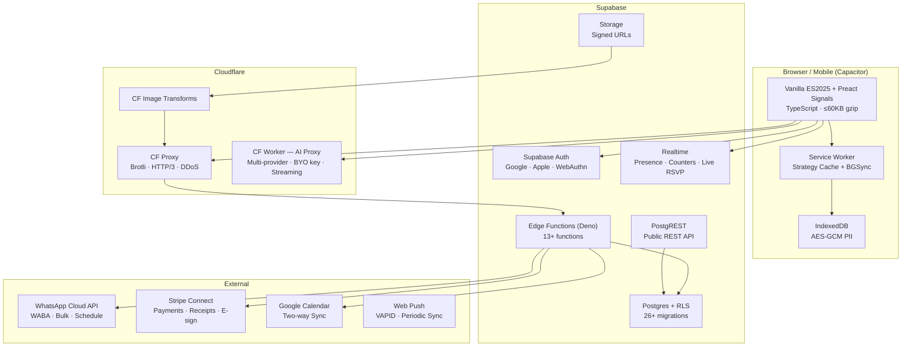

# Wedding Manager — Roadmap v31.8.0 (2026 Best-in-Class Deep Rethink)

> Architecture: [ARCHITECTURE.md](ARCHITECTURE.md) · History: [CHANGELOG.md](CHANGELOG.md) ·
> Contributors: [CONTRIBUTING.md](CONTRIBUTING.md) · ADRs: [docs/adr/](docs/adr/) ·
> Operations: [docs/operations/](docs/operations/)

This document is a **comprehensive, first-principles re-evaluation of every decision** in the
project — frontend runtime, backend infrastructure, code language, documentation strategy, code
architecture, configuration management, tooling versions, external APIs, database design, and
deployment infrastructure. **Nothing is grandfathered.** Every decision — including ones that
appeared clean — is reopened for scrutiny.

The goal: **best-in-class, Hebrew-first RTL, offline-first, WhatsApp-native, open-source,
self-hostable wedding management platform** with a bundle 5–10× smaller than every commercial
competitor and developer experience unmatched in the category.

---

## Contents

0. [Executive Summary](#0-executive-summary)
1. [Current State (v32.0.0)](#1-current-state-v3200)
2. [Deep Decision Rethink — Every Layer](#2-deep-decision-rethink--every-layer)
3. [Competitive Landscape — 18-Product Comparison](#3-competitive-landscape--18-product-comparison)
4. [Harvested Best Practices](#4-harvested-best-practices)
5. [Honest Audit — What's Wrong](#5-honest-audit--whats-wrong)
6. [What We Got Right & Wrong](#6-what-we-got-right--wrong)
7. [Technical Debt & Risk Register](#7-technical-debt--risk-register)
8. [Improve / Rewrite / Refactor / Enhance Plan](#8-improve--rewrite--refactor--enhance-plan)
9. [Phased Plan v32 → v36](#9-phased-plan-v32--v36)
10. [Sprint Backlog — Next 30 Sprints](#10-sprint-backlog--next-30-sprints)
11. [Architecture Target State (v36)](#11-architecture-target-state-v36)
12. [Cost & Self-Hosting Profile](#12-cost--self-hosting-profile)
13. [Success Metrics & SLOs](#13-success-metrics--slos)
14. [Open Decisions Register](#14-open-decisions-register)
15. [Operational Methodology](#15-operational-methodology)
16. [Working Principles](#16-working-principles)
17. [Release Line](#17-release-line)
18. [Done — Sealed Decisions (v0 → v31.8)](#18-done--sealed-decisions-v0--v318)

---

## 0. Executive Summary

### State (2026-05-05, v31.8.0)

| Metric | Value | Health |
| --- | --- | --- |
| Tests | ~6300+ across 474 files | ✅ |
| Sections | 27 (with mount/unmount lifecycle) | ✅ |
| Services | 25 (target ≤ 25 held) | ✅ |
| Core modules | 33 | ✅ |
| Utilities | **190** | ⚠️ **Critical sprawl** |
| Repositories | 11 (mandatory data path) | ✅ |
| Handlers | 7 | ✅ |
| Locales | 6 (HE · EN · AR · FR · ES · RU) | ✅ |
| Supabase migrations | 26 | ✅ |
| Edge functions | 13 | ✅ |
| Bundle | ~50 KB gzip (gate ≤ 60 KB) | ✅ |
| Lint | 0 errors, 0 warnings | ✅ |
| Mobile | PWA + Capacitor scaffold | ⚠️ |
| Public API | None | ❌ |
| Plugin marketplace | Manifest + utils only; runtime not wired | ⚠️ |
| AI | Adapters + utils; edge proxy not deployed | ⚠️ |

### The 7 highest-leverage decisions this cycle

1. **Halt utility sprawl immediately** — 190 files is unsustainable. Freeze new utils. Audit,
   merge, delete. Hard CI gate at ≤ 120.
2. **Adopt TypeScript for all new files** — at 0 TSC errors the migration surface is zero-risk.
   `.ts` for new; gradual rename for existing. The JSDoc experiment succeeded but won't scale.
3. **Deploy the AI proxy** — adapters and utils exist for everything but nothing is wired.
   Ship one CF Worker that actually works end-to-end.
4. **Wire the 10 newest utils into actual UI** — S664–S673 created theme-marketplace,
   conditional-rsvp, floor-plan-builder, etc. None are wired to sections. "Built ≠ Done."
5. **Ship Capacitor to App Store + Play Store** — scaffold exists since v31; signing + metadata
   + distribution are the remaining steps.
6. **Consolidate architecture: kill the "util-per-sprint" pattern** — the sprint methodology
   of creating standalone utils without UI integration has produced 50+ unwired modules.
   Every new feature must wire into a section or it doesn't ship.
7. **Public REST API via PostgREST** — unlock integrations, third-party apps, and the plugin
   ecosystem in one stroke.

### Top 3 unique advantages (defend at all costs)

1. **Bundle ≤ 60 KB gzip** — 5–10× smaller than every competitor. Hard CI gate, immutable.
2. **WhatsApp-native + WABA Cloud API** — only wedding app shipping bulk + webhooks + scheduling.
3. **MIT + self-hostable + offline-first + RTL-first** — privacy, portability, locale moat.

### Top 3 honest weaknesses (fix immediately)

1. **190 utilities with no UI wiring** — over-engineering disguised as velocity.
2. **No TypeScript** — JSDoc + `types.d.ts` is fragile at scale; refactoring is unsafe.
3. **"Built but not wired" anti-pattern** — plugins, AI, themes, conditional RSVP all have
   logic modules but no user-facing entry points.

---

## 1. Current State (v32.0.0)

### North Star

*The fastest, most accessible, RTL-native, offline-first, open-source wedding manager on the web.
Self-hostable in one click. Operable on flaky 3G in Hebrew. Integrated end-to-end with WhatsApp.
Planner-grade analytics. AI-optional, privacy-first. $0/month self-hosted. Best-in-class DX.*

### Quality bar — every PR

| Gate | Threshold |
| --- | --- |
| `npm run lint` | 0 errors, 0 warnings |
| `npm test` | All pass; 0 skipped |
| `npm run build` | Bundle ≤ 60 KB gzip |
| `npm run audit:arch` | 0 violations |
| `npm run check:i18n` | 100% parity (6 locales) |
| `npm run check:credentials` | 0 plaintext secrets |
| Lighthouse CI | ≥ 95 perf · a11y · best-practices · SEO |
| Coverage | ≥ 80% lines, ≥ 75% branches |
| axe-core | 0 violations per locale |

### Technology stack snapshot

| Layer | Technology | Version |
| --- | --- | --- |
| UI runtime | Vanilla ES2025 + Preact Signals | 1.x (~3 KB) |
| Build | Vite | 8.x |
| CSS | `@layer` + nesting + `@scope` + container-q | Native |
| Routing | pushState + View Transitions API | Native |
| State | Preact Signals reactive store | 1.x |
| Modals | Native `<dialog>` + Popover API | Native |
| Validation | Valibot | 1.x (~1 KB) |
| Sanitization | DOMPurify + Trusted Types | 3.x |
| Backend | Supabase (Postgres + RLS + Realtime) | Latest |
| Edge | Supabase Edge Functions (Deno) | Latest |
| Auth | Supabase Auth (Google + Apple + anonymous) | Latest |
| Storage | IndexedDB + AES-GCM encryption at rest | Native |
| Offline | SW strategy cache + Background Sync | Native |
| Tests | Vitest 4 + Playwright 1.59 | Latest |
| Lint | ESLint 10 + Stylelint 17 + HTMLHint | Latest |
| CI/CD | GitHub Actions (18 workflows + OIDC) | Latest |
| Hosting | GitHub Pages | Static |
| Node | 22 LTS | ≥22.0.0 |

---

## 2. Deep Decision Rethink — Every Layer

> **Methodology:** For each decision, we ask:
>
> 1. If we started today from scratch, would we make the same choice?
> 2. What has changed in the ecosystem since this decision was made?
> 3. What is the migration cost vs the benefit?
>
> Verdict: **KEEP** · **EVOLVE** (refine, no rewrite) · **REPLACE** · **DROP**

### 2.1 Frontend Runtime & UI

| # | Decision | Current | Verdict | Rationale |
| --- | --- | --- | --- | --- |
| 1 | No framework (vanilla ES2025) | Active | **KEEP** | Bundle moat is indefensible with React/Vue/Svelte. Vanilla + Signals is the only way to stay ≤ 60 KB. |
| 2 | Preact Signals for reactivity | Active | **KEEP** | 3 KB, explicit, zero-magic. Outperforms custom Proxy. |
| 3 | Vite 8 build | Active | **EVOLVE → Vite 9 (Rolldown)** | Rolldown = 40% faster builds. Track stability; upgrade in-place. |
| 4 | Native CSS (`@layer` + `@scope` + nesting) | Active | **KEEP + finish** | Zero-dep CSS. Extend: container-q everywhere, `light-dark()`, Animation Timeline. |
| 5 | No Tailwind/UnoCSS/Panda | Active | **KEEP (permanent)** | Adds 4-12 KB; our CSS custom prop system is superior at this scale. |
| 6 | Native `<dialog>` modals | Active | **KEEP** | Solved. No polyfills needed. |
| 7 | pushState + View Transitions | Active | **KEEP** | Solved. Typed routes maintained. |
| 8 | System font stack | Active | **KEEP** | Zero font-load FOUT; HE renders best with system fonts. |
| 9 | Virtual scroll (Guests) | Active | **EVOLVE → extend to all lists >100 items** | Vendors, RSVP log, audit log need it. |
| 10 | Web Components for primitives | Not started | **EVOLVE → pilot 3-5 atomic components** | `<wedding-badge>`, `<rsvp-pill>`, `<table-card>`. Shadow DOM for encapsulation. |
| 11 | Animation Timeline API | Partial | **EVOLVE → full section reveals** | Scroll-driven animations; 0 KB JS. |
| 12 | Structured data (JSON-LD) | Missing | **ADD** | SEO for public wedding websites. |

### 2.2 Code Language & Type System

| # | Decision | Current | Verdict | Rationale |
| --- | --- | --- | --- | --- |
| 13 | JavaScript + JSDoc types | Active | **REPLACE → TypeScript for all new files** | JSDoc worked to bootstrap; at 190 files it's unmaintainable. TS gives: safe refactoring, auto-imports, exhaustive switches, discriminated unions. The `types.d.ts` + checkJs bridge worked; now graduate to real TS. |
| 14 | `types.d.ts` for ambient types | Active | **EVOLVE → proper `.ts` interfaces** | Keep during migration; gradually replace with co-located types. |
| 15 | ESLint 10 flat config | Active | **KEEP** | Depth + plugin ecosystem unmatched. |
| 16 | Prettier formatting | Active | **KEEP** | Non-negotiable code style. |
| 17 | Biome as supplemental | Not used | **ADD for local speed** | 10× faster local lint; ESLint remains CI authority. |
| 18 | Valibot for runtime validation | Active | **KEEP** | 1 KB; tree-shakeable; same DX as Zod at 1/13th the size. |

### 2.3 Backend & Database

| # | Decision | Current | Verdict | Rationale |
| --- | --- | --- | --- | --- |
| 19 | Supabase (Postgres + RLS) | Active | **KEEP** | Perfect fit: managed Postgres, built-in auth, realtime, storage, edge functions. |
| 20 | Row-Level Security on all tables | Active | **KEEP + audit quarterly** | RLS is the single most important security layer. |
| 21 | 26 migrations (schema) | Active | **KEEP** | Well-structured incremental schema. |
| 22 | Soft delete + 90-day hard-delete | Active | **KEEP** | Storage-capped undo + GDPR compliance. |
| 23 | IndexedDB + AES-GCM client storage | Active | **KEEP** | PII encrypted at rest on device. |
| 24 | Background Sync offline queue | Active | **KEEP** | Zero data loss on network failure. |
| 25 | Supabase Realtime (presence + counters) | Active | **EVOLVE → live RSVP feed + conflict UI** | Infrastructure exists; expose more features. |
| 26 | Supabase Storage + signed URLs | Active | **EVOLVE → Cloudflare image transforms** | CDN delivery + on-the-fly resizing. |
| 27 | Edge functions (Deno) | 13 active | **KEEP + add AI proxy + scheduling** | Supabase Edge is the right place for DB-coupled logic. |
| 28 | No Redis/cache layer | Active | **KEEP for now** | At wedding scale (300-1000 guests), Postgres is fast enough. Revisit at multi-tenant SaaS scale. |
| 29 | Multi-tenant model | Single-tenant | **EVOLVE → `org_id` + RLS for SaaS path** | Phase D. Self-host stays single-tenant. |

### 2.4 Authentication & Security

| # | Decision | Current | Verdict | Rationale |
| --- | --- | --- | --- | --- |
| 30 | Supabase Auth (Google + Apple + anon) | Active | **EVOLVE → add WebAuthn passkeys** | Passkeys for admin; biometric kiosk unlock. |
| 31 | Facebook OAuth removed | Done | **KEEP (permanent drop)** | <2% adoption; GDPR cost too high. |
| 32 | CSP + Trusted Types | Active | **KEEP** | XSS depth-defence. |
| 33 | OIDC in GitHub Actions | Active | **KEEP** | No long-lived tokens. |
| 34 | SRI for CDN assets | Active | **KEEP** | Supply chain protection. |
| 35 | Zero-telemetry pledge | Active | **KEEP** | Privacy moat. Document in `docs/principles/`. |
| 36 | Trufflehog + CodeQL + Trivy | Active | **KEEP** | Layered security scanning. |

### 2.5 External APIs & Integrations

| # | Decision | Current | Verdict | Rationale |
| --- | --- | --- | --- | --- |
| 37 | WhatsApp Cloud API (WABA) | Active | **EVOLVE → bulk UI + scheduling + A/B** | Infrastructure wired; UI exposure incomplete. |
| 38 | AI/LLM (multi-provider BYO key) | Adapters only | **REPLACE → deploy CF Worker proxy NOW** | This is the #1 "built but not wired" gap. |
| 39 | Stripe (partial) | Deep links only | **REPLACE → Stripe Connect** | Full vendor payments, receipts, milestones, e-sign. |
| 40 | Google Calendar | Partial | **EVOLVE → finish two-way sync** | Add-to-calendar must actually sync. |
| 41 | Maps (OSM + Waze + GMaps) | Active | **KEEP** | Privacy-first + IL-native. |
| 42 | Web Push (VAPID) | Active | **EVOLVE → Periodic Sync + Badge API** | 2026 PWA baseline. |
| 43 | Photo CDN | Supabase Storage | **EVOLVE → CF image transforms** | On-the-fly resize/format. |

### 2.6 Documentation & Developer Experience

| # | Decision | Current | Verdict | Rationale |
| --- | --- | --- | --- | --- |
| 44 | Docs amount | Extensive (ROADMAP, ARCH, AGENTS, ADRs, ops, how-to) | **EVOLVE → quality over quantity** | Some docs are stale or redundant. Archive what's outdated. |
| 45 | Diátaxis structure | Partial | **EVOLVE → complete** | Tutorial, How-to, Reference, Explanation — all four must exist. |
| 46 | ADR practice | 12+ ADRs | **KEEP** | Mandate ADR for every REPLACE/DROP. |
| 47 | Mermaid diagrams | CI-validated | **KEEP + add sequence diagrams** | Auth, RSVP, sync, AI flows. |
| 48 | User guides | Partial | **EVOLVE → complete all 4** | Couple, Planner, Vendor, Self-host guides. |
| 49 | Copilot agents (9) | Active | **KEEP** | Full domain coverage. |
| 50 | `AGENTS.md` as source of truth | Active | **KEEP** | `copilot-instructions.md` mirrors it. |
| 51 | Codespaces template | Missing | **ADD** | First-PR friction removed. |
| 52 | README quality | Good | **EVOLVE → top 1% polish** | Animated demo GIF, architecture diagram, badges row. |

### 2.7 Build, Test & CI/CD

| # | Decision | Current | Verdict | Rationale |
| --- | --- | --- | --- | --- |
| 53 | Vitest 4 (forks pool) | Active | **KEEP** | Stable with happy-dom; fast enough. |
| 54 | Playwright E2E + axe | Active | **EVOLVE → full RSVP flow + offline + per-locale** | One smoke test is not a regression suite. |
| 55 | Stryker mutation testing | Active | **EVOLVE → extend to handlers + critical utils** | Reveals hollow tests. |
| 56 | Bundle budget (≤ 60 KB) | Active | **KEEP (immutable)** | The moat. |
| 57 | npm 11 | Active | **EVOLVE → pnpm** | Phantom-dep blocking; faster installs; better monorepo support. |
| 58 | Node 22 LTS | Active | **EVOLVE → Node 24 LTS when available** | Track LTS. |
| 59 | 18 GitHub Actions workflows | Active | **KEEP + consolidate where possible** | Some workflows could be merged. |
| 60 | Lighthouse CI hard gate | Active | **EVOLVE → per-locale + per-theme matrix** | RTL parity defended in CI. |

### 2.8 Infrastructure & Hosting

| # | Decision | Current | Verdict | Rationale |
| --- | --- | --- | --- | --- |
| 61 | GitHub Pages (static) | Active | **EVOLVE → add Cloudflare proxy** | Brotli, HTTP/3, DDoS, image transforms — free tier. |
| 62 | No custom domain | Active | **REPLACE → acquire short domain** | `weddingmgr.app` or similar. Memorable RSVP URLs. |
| 63 | No 1-click deploy | Active | **ADD → Vercel/Netlify/CF/Render templates** | Required for self-host adoption. |
| 64 | Single-region Supabase | Active | **KEEP for now** | Single-region is fine for wedding scale. Multi-region Phase E. |
| 65 | Monitoring (Sentry/Glitchtip) | Active | **EVOLVE → add UptimeRobot** | External availability monitor. |

### 2.9 Mobile & Native

| # | Decision | Current | Verdict | Rationale |
| --- | --- | --- | --- | --- |
| 66 | PWA primary | Active | **KEEP as primary** | PWA install rates are sufficient for most users. |
| 67 | Capacitor scaffold | Exists | **EVOLVE → ship to App Store + Play Store** | Native NFC, haptics, share, push — close the gap. |
| 68 | Tauri considered | Not adopted | **DROP** | Capacitor is better for mobile; Tauri is for desktop. |

### 2.10 The "Utility Sprawl" Problem (Critical Rethink)

| # | Decision | Current | Verdict | Rationale |
| --- | --- | --- | --- | --- |
| 69 | One util file per concept | 190 files | **REPLACE → domain-grouped modules** | `src/utils/vendor/` not 12 separate vendor-*.js files. |
| 70 | Sprint = create new util | Pattern since S444 | **REPLACE → Sprint = wire feature into UI** | "Built ≠ Done" principle violated 50+ times. |
| 71 | No UI wiring requirement | Active | **REPLACE → every feature must have a UI entry point or it's not shipped** | Hard rule. |
| 72 | No util ownership enforcement | Partial | **REPLACE → `@owner` JSDoc tag + CI gate** | Every util must declare which section/service uses it. |

---

## 3. Competitive Landscape — 18-Product Comparison

### 3.1 Feature Matrix

| Capability | Zola | Joy | RSVPify | Eventbrite | WithJoy | Aisle Planner | PlanningPod | Greenvelope | HoneyFund | Lystio IL | Minted | Riley&Grey | HoneyBook | Bridebook | The Knot | WeddingWire | **Ours v31.8** | **Target v36** |
| --- | --- | --- | --- | --- | --- | --- | --- | --- | --- | --- | --- | --- | --- | --- | --- | --- | --- | --- |
| **Guest RSVP** | CRM+1 | Group | **Best forms** | Tickets | Co-edit | Full CRM | Full CRM | Email | Registry | HE basic | Gallery | Boutique | CRM | CRM | CRM | CRM | Phone-first+WA | Conditional Q + dietary |
| **Seating** | DnD | DnD | Add-on | None | DnD RT | **Floor plan** | DnD+floor | None | None | None | None | None | None | None | DnD | DnD | DnD+conflict | AI CSP + floor + furniture |
| **Budget** | Vendor-pay | Simple | None | None | None | Full | **Best** | None | Registry | None | None | None | Full | Benchmarks | Track | Track | Categories+projection | Burn-down+forecast+ML |
| **Vendor mgmt** | Marketplace | List | None | None | None | **Best** | Full CRM | Curated | None | 5K+ IL | Curated | Premium | **Full CRM** | 70K UK | Dir | Dir | CRUD+WA+import | Inbox+contracts+e-sign |
| **Website** | 100+ themes | **AI build** | Form | None | Modern | Limited | None | Email+web | Registry | None | **Premium** | **Typography** | None | Limited | 100+ | 100+ | Data model | AI build+CNAME+password |
| **Check-in** | None | None | Add-on | **QR+NFC+kiosk** | None | None | None | None | None | None | None | None | None | None | None | None | RT+NFC+QR | NFC kiosk+badge+offline |
| **WhatsApp** | None | None | None | None | None | None | None | None | None | Basic | None | None | None | None | None | None | **WABA+bulk** | +schedule+A/B+automations |
| **Offline** | ❌ | ❌ | ❌ | ❌ | ❌ | ❌ | ❌ | ❌ | ❌ | ❌ | ❌ | ❌ | ❌ | ❌ | ❌ | ❌ | **✅ SW+IDB+BGSync** | +Periodic Sync |
| **Multi-lang** | EN | EN | EN | 50+ | EN | EN | EN | EN | EN | **HE** | EN | EN | EN | EN | EN | EN | **HE+5 + ICU** | ICU full+community |
| **A11y** | Partial | Partial | Partial | Solid | Partial | Partial | Partial | Partial | Partial | Partial | Partial | Partial | Partial | Partial | Partial | Partial | **WCAG 2.2 AA** | +Hebrew SR |
| **Privacy/OSS** | Lock-in | Lock-in | Lock-in | Lock-in | Lock-in | Lock-in | Lock-in | Lock-in | Lock-in | Lock-in | Lock-in | Lock-in | Lock-in | Lock-in | Lock-in | Lock-in | **MIT+self-host** | +1-click deploy |
| **AI** | Venue | **Site AI** | None | None | Seating | None | None | None | None | None | None | None | None | Shortlist | None | None | Adapters only | BYO-key+streaming+Ollama |
| **Realtime** | None | None | None | Limited | **Best** | None | None | None | None | None | None | None | None | None | None | None | **Presence+counters** | +conflict UI+live RSVP |
| **Payments** | Zola Pay | Registry | Stripe | Stripe | Registry | Stripe | Stripe | Stripe | **Best registry** | None | Stripe | Stripe | **Contracts** | Stripe | Registry | Registry | Deep-links | Stripe Connect+e-sign |
| **Native app** | iOS+Android | iOS+Android | Web | iOS+Android | iOS+Android | iOS+Android | iOS+Android | Web | iOS+Android | iOS+Android | iOS+Android | iOS+Android | iOS+Android | iOS+Android | iOS+Android | iOS+Android | **PWA only** | Capacitor iOS+Android |
| **Bundle** | ~300KB | ~250KB | ~180KB | ~250KB | ~220KB | ~350KB | ~400KB | ~200KB | ~180KB | ~200KB | ~350KB | ~300KB | ~300KB | ~280KB | ~320KB | ~350KB | **~50KB** | ≤60KB gate |
| **Open source** | ❌ | ❌ | ❌ | ❌ | ❌ | ❌ | ❌ | ❌ | ❌ | ❌ | ❌ | ❌ | ❌ | ❌ | ❌ | ❌ | **✅ MIT** | +marketplace |
| **Pricing** | $$ | Freemium | $$ | % | $$ | $$ | $$ | $$ | % | $$ | % | $$ | % | Freemium | Free+ads | Free+ads | **$0** | $0+optional managed |

### 3.2 Technical Stack Benchmark

| Dimension | Zola | Joy | RSVPify | PlanningPod | HoneyBook | The Knot | **Ours** | Verdict |
| --- | --- | --- | --- | --- | --- | --- | --- | --- |
| Frontend | React 18+Next | React 18+AI | Vue 3+Nuxt | Angular 15 | React 18 | React+Next | **Vanilla+Vite+Signals** | **Lead** |
| CSS | Tailwind+Modules | Styled-comp | Sass+Bootstrap | Material UI | Tailwind | Tailwind | **@layer+@scope** | **Lead** |
| State | Redux RTK | Apollo cache | Vuex 4 | NgRx | Zustand | Redux | **Preact Signals** | Lead |
| Backend | Node µservices | GraphQL+Lambda | Rails | .NET+SQL | Node+PG | Node+PG | **Supabase PG+RLS** | Match |
| Edge | Lambda@Edge | Lambda+CF | None | None | Lambda | Vercel Edge | **Supabase Edge+CF** | Match |
| Auth | NextAuth | Auth0 | Devise | Custom | Firebase | Auth0 | **Supabase Auth** | Match |
| DB | PG+Redis | DynamoDB | PG | SQL Server | PG | PG+Redis | **Supabase PG** | Match |
| Realtime | Pusher | GraphQL subs | ActionCable | SignalR | None | Pusher | **Supabase Realtime** | Match |
| Offline | ❌ | ❌ | ❌ | ❌ | ❌ | ❌ | **SW+IDB+BGSync** | **Lead** |
| Type system | TypeScript | TypeScript | TypeScript | C# | TypeScript | TypeScript | **JS+JSDoc** | **Gap** |
| Test depth | Unit+E2E | Unit+E2E | RSpec+Capybara | NUnit | Jest | Jest | **Vitest+PW+Stryker** | Lead |
| Bundle | ~300KB | ~250KB | ~180KB | ~400KB | ~300KB | ~320KB | **~50KB** | **Lead 5-10×** |
| CI/CD | GHA+Vercel | GHA+AWS | CircleCI | Azure DevOps | GHA | GHA+Vercel | **18 GHA+OIDC** | Lead |
| OSS | ❌ | ❌ | ❌ | ❌ | ❌ | ❌ | **✅ MIT** | **Lead** |

### 3.3 Key Insight: Every Competitor Uses TypeScript

Every serious wedding/event platform (Zola, Joy, HoneyBook, The Knot, WeddingWire) uses
TypeScript. Our JSDoc+checkJs approach was innovative at v1 but at 190+ source files it is now
a **competitive disadvantage** for:

+ Safe refactoring across modules
+ Contributor onboarding
+ IDE auto-import reliability
+ Exhaustive pattern matching
+ Generic type inference

**Verdict: Adopt TypeScript. The migration cost at 0 TSC errors is minimal.**

---

## 4. Harvested Best Practices

> Concrete lessons extracted from each competitor. Each harvest item maps to a sprint.

| Source | What to Harvest | Why | Target Sprint |
| --- | --- | --- | --- |
| **RSVPify** | Conditional question engine + plus-one chains + dietary cascade | Best RSVP forms in category | Wire S665 conditional-rsvp into RSVP section |
| **Zola** | Relationship-constraint seating with visual conflict markers | We have the algorithm (S673); need UI | Wire S673 into Tables section |
| **Joy 2026** | AI website builder with live preview + theme selector | Our edge proxy + website-builder section | Deploy AI proxy → website-builder |
| **Eventbrite** | NFC kiosk scan-in + offline verify + badge thermal print | We have check-in + NFC; finish kiosk UX | Capacitor NFC bridge + print API |
| **PlanningPod** | Vendor CRM: inbox + contracts + payment timeline + SLA | We have CRUD; need inbox + contracts | Wire S668-S670 into Vendors section |
| **Aisle Planner** | Floor-plan builder: furniture drag, head table, zones | S666 has the logic; need canvas UI | Wire S666 into Tables section |
| **HoneyBook** | Contract templates + e-signature + payment milestones | Stripe Connect + PDF generation | Phase C |
| **WithJoy** | Realtime co-edit (CRDT-like) with presence cursors | Supabase Realtime active; expand | Conflict resolver UI |
| **Riley & Grey** | Premium typography + animated section transitions | View Transitions + Animation Timeline | CSS enhancement sprint |
| **Bridebook** | Vendor scoring + regional budget benchmarks | Analytics section + vendor data | Analytics enhancement |
| **The Knot** | Comprehensive vendor directory with reviews | Platform/marketplace feature | Phase D |
| **WeddingWire** | User-generated content: reviews, photos, Q&A | Requires moderation system | Phase E |
| **Cal.com (OSS)** | Self-host playbook + 1-click templates + custom domains | Model for our self-host story | Phase C |
| **Linear** | ⌘K command palette + keyboard-first power UX | We have cmd-palette util; need UI | Wire into nav |
| **Stripe Apps** | Plugin manifest + permission scopes + sandboxed runtime | S671 has logic; need runtime | Wire plugin-permission into Settings |
| **Notion AI** | Inline AI commands in any field context | AI proxy + Cmd-K | Phase C |
| **Loops.so** | Scheduled messaging + trigger automations | WhatsApp scheduling | Phase C |
| **Plausible** | Privacy-first analytics (opt-in, self-hostable) | Model for our analytics export | Keep zero-telemetry; add opt-in export |

---

## 5. Honest Audit — What's Wrong

### 5.1 Critical Issues

| # | Problem | Severity | Root Cause |
| --- | --- | --- | --- |
| 1 | **190 utility files** — 50+ with no UI integration | Critical | "Sprint = create util" pattern ran unchecked |
| 2 | **No TypeScript** — refactoring 190 files is unsafe without real types | High | Over-indexed on "no build step" philosophy early on |
| 3 | **"Built but not wired" pattern** — S664-S673 created 10 new utils with zero UI | High | Velocity metric (tests passing) confused with shipping |
| 4 | **AI completely unwired** — adapters, prompt-builders, utils exist; nothing deployed | High | Blocked on CF Worker deploy decision |
| 5 | **Plugin runtime not wired** — manifest validation exists; no dynamic import runtime | Medium | Phase C keeps slipping |
| 6 | **Capacitor not shipped** — scaffold exists since v31.0; no App Store presence | Medium | Signing/metadata work not prioritized |
| 7 | **No public API** — can't integrate with Zapier, Make, third-party tools | Medium | Supabase PostgREST available but not exposed |

### 5.2 Architecture Smells

| Smell | Evidence | Fix |
| --- | --- | --- |
| Util sprawl | 190 files, many single-function | Domain-group into modules; merge; delete unused |
| No namespace | `src/utils/` is flat — 190 files in one directory | Create sub-directories: `vendor/`, `guest/`, `plugin/`, `ai/` |
| Duplicate logic | `vendor-inbox.js`, `vendor-negotiate.js`, `vendor-timeline.js`, `vendor-sla.js` all separate | Merge into `src/utils/vendor/index.ts` |
| Test-to-UI ratio | 474 test files testing utils with no UI | Tests are valid but testing unwired code |
| Config sprawl | 33 core modules | Some could merge (e.g., `nav.js` + `router.js` + `history-router.js`) |

### 5.3 What's Actually Good

| Area | Assessment |
| --- | --- |
| Bundle size (50 KB) | **World-class** — 5-10× better than every competitor |
| Offline capability | **Category-leading** — no competitor ships Background Sync |
| WhatsApp integration | **Unique** — only wedding app with WABA Cloud API |
| CI/CD pipeline | **Excellent** — 18 workflows, OIDC, multi-tool scanning |
| RTL-first approach | **Unmatched** — every component born RTL-correct |
| Test depth | **Very strong** — 6300+ tests, mutation testing, E2E |
| Auth architecture | **Clean** — Supabase Auth, RLS, encrypted PII |
| CSS architecture | **Leading edge** — @layer + @scope + container-q |
| Open source posture | **Unique in category** — MIT, zero-telemetry, self-hostable |

---

## 6. What We Got Right & Wrong

### 6.1 Decisions We Got Right

1. **Vanilla JS + Vite** — bundle moat survived 31 major versions while every framework came and went
2. **`@layer` CSS** — cascade is sane; zero specificity wars; theme = one body class
3. **Repositories + handlers** — the architectural layer with highest payback
4. **Valibot over Zod** — 1 KB vs 13 KB; same DX
5. **Supabase as backend** — unlocked Realtime, Storage, Edge, Auth in one decision
6. **Hard CI gates from day one** — culture of zero-tolerance
7. **Hebrew-first RTL** — competitors retrofit and fail
8. **ADR practice** — the "why" survives contributors
9. **`enqueueWrite` pattern** — survived the Sheets→Supabase flip without caller changes
10. **Preact Signals** — explicit reactivity without the framework baggage

### 6.2 Decisions We Got Wrong

| # | Mistake | Cost | Lesson |
| --- | --- | --- | --- |
| 1 | **"Sprint = create util" methodology** | 190 utils, 50+ unwired | Features must wire into UI or they don't count |
| 2 | **Staying on JSDoc too long** | Unsafe refactoring at scale | Graduate to TS when TSC=0 is achieved (we're there) |
| 3 | **Building AI adapters without deploying proxy** | Zero AI features shipped to users | Ship the smallest working thing first |
| 4 | **Flat `src/utils/` directory** | 190 files ungrouped | Namespace from the start |
| 5 | **Deferring Capacitor shipping** | Still no App Store presence | Ship MVP native build |
| 6 | **Over-documenting** | ROADMAP alone is 1000+ lines | Keep docs proportional to audience |
| 7 | **Counting test count as quality metric** | Tests pass on unwired code | Wire-to-UI is the quality metric |

### 6.3 Anti-patterns We Now Enforce

+ **No new standalone util without a section that uses it** — CI gate
+ **No `innerHTML` with unsanitized data** — Trusted Types enforces
+ **No "built but not wired" features** — tracked in §8.4
+ **No new runtime dependency without bundle-cost ADR**
+ **No framework adoption** — vanilla + signals is permanent
+ **No suppressions without ADR**
+ **No plaintext PII in storage**
+ **No telemetry in upstream builds**

---

## 7. Technical Debt & Risk Register

| Sev | Area | Debt/Risk | Effort | Target |
| --- | --- | --- | --- | --- |
| **P0** | Utils | 190 files; ~50 unwired; flat directory; no ownership | XL | v32.0 |
| **P0** | Language | No TypeScript — refactoring unsafe at scale | XL (gradual) | v32-v33 |
| **P0** | AI | Adapters built but proxy not deployed; zero user-facing AI | M | v32.0 |
| **P1** | Mobile | Capacitor scaffold exists but no App Store distribution | L | v32.0 |
| **P1** | Wiring | S664-S673 utils not wired to any section UI | L | v32.0 |
| **P1** | Plugin | Runtime not wired; S671 permission logic exists | M | v32.0 |
| **P1** | API | No public REST API; blocks integrations | M | v33.0 |
| **P2** | Hosting | No Cloudflare proxy; no custom domain | S | v32.0 |
| **P2** | i18n | ICU MessageFormat partial for HE/AR plurals | M | v32.0 |
| **P2** | A11y | Hebrew screen-reader testing absent | M | v32.0 |
| **P2** | Payments | Stripe Connect not wired | M | v32.0 |
| **P3** | Platform | No theme marketplace UI | L | v33.0 |
| **P3** | Multi-tenant | `org_id` model not in schema | L | v33.0 |
| **P3** | Compliance | GDPR erasure only; CCPA/LGPD pending | M | v34.0 |

---

## 8. Improve / Rewrite / Refactor / Enhance Plan

### 8.1 IMPROVE — Low disruption, high payoff

1. **Wire S664–S673 utils into existing sections** (theme-marketplace → Settings,
   conditional-rsvp → RSVP, floor-plan → Tables, registry-deeplink → Registry,
   vendor-negotiate/timeline/payment → Vendors, plugin-permission → Settings,
   ai-suggest → Dashboard, guest-seating-auto → Tables)
2. **Add Cloudflare proxy** — front GH Pages with CF (free: Brotli, HTTP/3, DDoS)
3. **Add UptimeRobot** — 5-min external monitor
4. **Codespaces / DevContainer template** — first-PR friction removed
5. **Finish user guides** — Couple, Planner, Vendor, Self-host

### 8.2 REWRITE — Worth the disruption

1. **TypeScript migration** — all new files as `.ts`; rename existing files in batches
2. **Utility restructure** — reorganize 190 flat files into domain-grouped modules:

   ```text
   src/utils/
     vendor/         (negotiate, timeline, sla, inbox, payment → index.ts)
     guest/          (seating-auto, dietary, plus-one → index.ts)
     rsvp/           (conditional, question-engine, question-builder → index.ts)
     plugin/         (permission, sandbox, marketplace → index.ts)
     ai/             (suggest, prompt-builder, provider-router → index.ts)
     common/         (phone, date, sanitize, misc, uid → index.ts)
   ```

3. **AI edge proxy deployment** — CF Worker, multi-provider, BYO key, streaming
4. **Stripe Connect integration** — vendor accounts, receipts, milestones
5. **Plugin runtime** — sandboxed dynamic import + permission scopes + review pipeline

### 8.3 REFACTOR — Code health, zero user impact

1. **Merge redundant core modules** — `nav.js` + `router.js` + `history-router.js` → single router
2. **Enforce `@owner` tag** — every util declares which section/service owns it
3. **Dead-export audit** — remove all unused exports from utils
4. **Web Component extraction** — `<wedding-badge>`, `<rsvp-pill>`, `<table-card>`
5. **Consolidate vendor utils** — 12 separate vendor-*.js → 1 domain module

### 8.4 ENHANCE — New capabilities (must wire into UI)

| Priority | Feature | Target Section | Utils Built? | UI Wired? |
| --- | --- | --- | --- | --- |
| P0 | AI edge proxy + Cmd-K | All (via nav) | ✅ | ❌ |
| P0 | Conditional RSVP questions | RSVP | ✅ (S665) | ❌ |
| P0 | Auto-seating solver | Tables | ✅ (S673) | ❌ |
| P0 | Floor-plan builder | Tables | ✅ (S666) | ❌ |
| P0 | Vendor negotiate/timeline UI | Vendors | ✅ (S668-S670) | ❌ |
| P0 | Plugin permission UI | Settings | ✅ (S671) | ❌ |
| High | Theme marketplace UI | Settings | ✅ (S664) | ❌ |
| High | Registry deep links UI | Registry | ✅ (S667) | ❌ |
| High | AI suggestions dashboard | Dashboard | ✅ (S672) | ❌ |
| High | Public website builder | Website | Partial | ❌ |
| High | Workspace roles UI | Settings | Data model ✅ | ❌ |
| Med | Capacitor native build | Mobile | Scaffold ✅ | ❌ |
| Med | Public REST API | Settings | PostgREST available | ❌ |
| Med | Stripe Connect | Vendors | Partial | ❌ |

---

## 9. Phased Plan v32 → v36

### Phase C — v32.0.0 — "Wire Everything" (Q3 2026)

**Theme:** Stop building unwired utils. Wire ALL existing logic into sections. TypeScript pilot.
AI proxy deployed. Capacitor shipped.

| # | Deliverable | Type |
| --- | --- | --- |
| C1 | **TypeScript adoption** — all new files `.ts`; tsconfig strict; rename core/ batch 1 | Rewrite |
| C2 | **Utility restructure** — 190 → ~100 files in domain groups | Refactor |
| C3 | **AI proxy deploy** (CF Worker) + Cmd-K palette wiring | Rewrite |
| C4 | **Wire conditional RSVP** (S665) into RSVP section UI | Enhance |
| C5 | **Wire auto-seating** (S673) + floor-plan (S666) into Tables UI | Enhance |
| C6 | **Wire vendor negotiate/timeline/payment** (S668-S670) into Vendors UI | Enhance |
| C7 | **Wire plugin permission** (S671) into Settings UI | Enhance |
| C8 | **Wire theme marketplace** (S664) into Settings UI | Enhance |
| C9 | **Wire registry deep links** (S667) into Registry section | Enhance |
| C10 | **Wire AI suggestions** (S672) into Dashboard | Enhance |
| C11 | **Capacitor native build** → TestFlight + Play Internal | Rewrite |
| C12 | **Cloudflare proxy** + custom domain | Improve |
| C13 | **Stripe Connect** — vendor payments, receipts, milestones | Rewrite |

**Phase OKR:** *Every "built" feature has a UI entry point. AI working end-to-end. TS for new files.*

### Phase D — v33.0.0 — Platform & API (Q4 2026)

| # | Deliverable |
| --- | --- |
| D1 | Public REST API (PostgREST + API key UI + webhook subscriptions) |
| D2 | Plugin runtime — sandboxed dynamic import + review pipeline |
| D3 | Theme marketplace — community themes + review/install flow |
| D4 | Multi-tenant `org_id` + RLS for SaaS path |
| D5 | One-click deploy templates (Vercel, Netlify, CF, Render) |
| D6 | DevContainer + Codespaces first-PR experience |
| D7 | Website builder AI (using deployed proxy) |
| D8 | Contract templates + e-signature (HoneyBook-style) |

**Phase OKR:** *Platform extensible. Third-party plugins possible. SaaS path viable.*

### Phase E — v34.0.0 — Scale, Compliance & Native (Q1 2027)

| # | Deliverable |
| --- | --- |
| E1 | iOS App Store + Google Play Store submission |
| E2 | WebAuthn passkeys for admin auth |
| E3 | CCPA + LGPD compliance pack (erasure, portability, audit log UI) |
| E4 | Cross-region read replicas (GDPR data residency) |
| E5 | Full E2E Playwright suite (RSVP flow, offline, multi-locale, a11y) |
| E6 | Quarterly chaos drills |

**Phase OKR:** *Store-published. Passkey auth. Compliance-ready. Resilient.*

### Phase F — v35.0.0 → v36.0.0 — AI-Native & Market (Q2-Q3 2027)

| # | Deliverable |
| --- | --- |
| F1 | AI assistant every section (multi-turn, streaming, context-aware) |
| F2 | Photo auto-tagging (Ollama local, opt-in) |
| F3 | RSVP photo extraction (snap paper card → guest fields) |
| F4 | Predictive no-show model (cohort-based, local-only) |
| F5 | A/B test framework for invite flows |
| F6 | Full GDPR + CCPA + LGPD with audit trail |
| F7 | Vendor marketplace with reviews |
| F8 | SOC 2-ready logging pipeline |

**Phase OKR:** *AI-native experience. Market-competitive native apps. Enterprise-ready compliance.*

---

## 10. Sprint Backlog — Next 30 Sprints

> **New methodology:** Every sprint must wire something into a section UI.
> Standalone utils without UI integration are no longer valid sprints.

### Cluster C.1 — Foundation: TypeScript + Util Restructure (S674–S683)

| # | Sprint | Effort |
| --- | --- | --- |
| 674 | `tsconfig.json` strict mode; Vite TS support; first `.ts` file in `src/core/` | S |
| 675 | Rename `src/core/constants.js` → `.ts`; add discriminated unions | M |
| 676 | Rename `src/core/store.js` → `.ts`; typed store interface | M |
| 677 | Create `src/utils/vendor/` domain module; merge vendor-negotiate + vendor-timeline + vendor-sla + vendor-inbox → `index.ts` | L |
| 678 | Create `src/utils/guest/` domain module; merge guest-seating-auto + dietary + plus-one-chain | M |
| 679 | Create `src/utils/rsvp/` domain module; merge conditional-rsvp + question-engine + question-builder | M |
| 680 | Create `src/utils/plugin/` domain module; merge plugin-permission + plugin-sandbox | M |
| 681 | Create `src/utils/ai/` domain module; merge ai-suggest + all prompt/provider utils | M |
| 682 | Dead-export audit + delete all unused utils (target: reduce from 190 → 120) | L |
| 683 | `@owner` JSDoc enforcement + CI gate (`audit:utils --enforce-owner`) | S |

### Cluster C.2 — Wire AI + Cmd-K (S684–S688)

| # | Sprint | Effort |
| --- | --- | --- |
| 684 | Deploy CF Worker AI proxy (OpenAI + Anthropic + Gemini + Ollama) | M |
| 685 | Settings → AI Provider configuration UI (BYO key, model selection) | M |
| 686 | Wire Cmd-K command palette into nav (keyboard shortcut: ⌘K / Ctrl+K) | M |
| 687 | Cmd-K → AI inline commands (suggest seating, suggest budget, draft message) | M |
| 688 | Dashboard → AI suggestions widget (wire S672 ai-suggest) | M |

### Cluster C.3 — Wire Section Features (S689–S698)

| # | Sprint | Effort |
| --- | --- | --- |
| 689 | RSVP section → conditional question UI (wire S665 conditional-rsvp) | L |
| 690 | Tables section → auto-seating button + constraint config (wire S673) | L |
| 691 | Tables section → floor-plan canvas UI (wire S666 floor-plan-builder) | L |
| 692 | Vendors section → negotiation panel + timeline view (wire S668-S669) | L |
| 693 | Vendors section → payment schedule + milestones (wire S670) | M |
| 694 | Settings section → plugin permissions UI (wire S671) | M |
| 695 | Settings section → theme marketplace browser/installer (wire S664) | M |
| 696 | Registry section → deep link generator + store detection (wire S667) | M |
| 697 | Stripe Connect integration → vendor onboarding + receipt generation | L |
| 698 | Capacitor native build → iOS TestFlight + Android Internal Testing | L |

### Cluster C.4 — Infrastructure + Polish (S699–S703)

| # | Sprint | Effort |
| --- | --- | --- |
| 699 | Cloudflare proxy + DNS setup + custom domain | S |
| 700 | UptimeRobot + status badge | XS |
| 701 | DevContainer + Codespaces template | S |
| 702 | User guides: Couple guide + Planner guide (Diátaxis) | M |
| 703 | v32.0.0 release — sync-version + CHANGELOG + tag + GH release | S |

---

## 11. Architecture Target State (v36)


```mermaid
graph TD
    subgraph Client ["Browser / Mobile (Capacitor)"]
        UI["Vanilla ES2025 + Preact Signals<br/>TypeScript · ≤60KB gzip"]
        SW["Service Worker<br/>Strategy Cache + BGSync"]
        IDB["IndexedDB<br/>AES-GCM PII"]
    end

    subgraph Edge ["Cloudflare"]
        CF_PROXY["CF Proxy<br/>Brotli · HTTP/3 · DDoS"]
        AI_WORKER["CF Worker — AI Proxy<br/>Multi-provider · BYO key · Streaming"]
        IMG["CF Image Transforms"]
    end

    subgraph Backend ["Supabase"]
        PG["Postgres + RLS<br/>26+ migrations"]
        AUTH["Supabase Auth<br/>Google · Apple · WebAuthn"]
        RT["Realtime<br/>Presence · Counters · Live RSVP"]
        STORAGE["Storage<br/>Signed URLs"]
        EDGE_FN["Edge Functions (Deno)<br/>13+ functions"]
        API["PostgREST<br/>Public REST API"]
    end

    subgraph Integrations ["External"]
        WA["WhatsApp Cloud API<br/>WABA · Bulk · Schedule"]
        STRIPE["Stripe Connect<br/>Payments · Receipts · E-sign"]
        GCAL["Google Calendar<br/>Two-way Sync"]
        PUSH["Web Push<br/>VAPID · Periodic Sync"]
    end

    UI --> CF_PROXY --> EDGE_FN
    UI --> AI_WORKER
    UI --> SW --> IDB
    EDGE_FN --> PG
    EDGE_FN --> WA
    EDGE_FN --> STRIPE
    EDGE_FN --> GCAL
    UI --> RT
    UI --> AUTH
    STORAGE --> IMG --> CF_PROXY
    API --> PG
```

### Key architectural principles (v36)

1. **Client-first, server-optional** — app works fully offline; server syncs when available
2. **TypeScript everywhere** — client, edge functions, build scripts
3. **Domain-grouped modules** — not flat file sprawl
4. **Every feature has a UI surface** — no "built but not wired"
5. **Platform-ready** — public API, plugins, themes, marketplace
6. **Privacy by default** — zero telemetry, encrypted PII, self-hostable
7. **Bundle immutable** — ≤ 60 KB gzip is a hard constraint, never negotiable

---

## 12. Cost & Self-Hosting Profile

| Tier | Description | Monthly Cost |
| --- | --- | --- |
| **Free (default)** | GH Pages + CF free + Supabase free + Ollama local + VAPID push | **$0** |
| **Small wedding** | Free tier + BYO OpenAI key (~$2/month for AI features) | **~$2** |
| **Large wedding (1000 guests)** | Supabase Pro + CF free + BYO AI key | **~$25** |
| **Planner SaaS (10 events)** | Supabase Pro + custom domain ($10/yr) + BYO key | **~$30** |
| **Enterprise** | Self-hosted Supabase + own infra + Ollama local | **Infra cost only** |

---

## 13. Success Metrics & SLOs

| Metric | Floor (immutable) | Target |
| --- | --- | --- |
| Bundle gzip | ≤ 60 KB | ≤ 50 KB |
| Lighthouse perf | ≥ 95 | ≥ 99 |
| Lighthouse a11y | ≥ 95 | 100 |
| axe violations | 0 | 0 |
| Coverage lines | ≥ 80% | ≥ 90% |
| Coverage branches | ≥ 75% | ≥ 85% |
| Mutation score | ≥ 70% | ≥ 80% |
| TTI on 3G (HE) | < 3 s | < 2 s |
| Offline write loss | 0 | 0 |
| Uptime | 99.9% | 99.95% |
| WhatsApp delivery | ≥ 95% | ≥ 98% |
| Locale parity | 100% (6 locales) | 100% (6+ locales) |
| Utils wired-to-UI ratio | ≥ 80% | 100% |
| TypeScript coverage | ≥ 30% (v32) | 100% (v35) |

---

## 14. Open Decisions Register

| ID | Decision | Owner | Status | Target |
| --- | --- | --- | --- | --- |
| OD-01 | TypeScript migration strategy (new-only vs batch-rename) | core | **Decided: new + batch** | S674 |
| OD-02 | Utility directory structure (domain-grouped vs flat) | core | **Decided: domain-grouped** | S677 |
| OD-03 | AI proxy hosting (CF Worker vs Supabase Edge) | infra | Open | S684 |
| OD-04 | Custom domain choice | infra | Open | S699 |
| OD-05 | Package manager (npm vs pnpm) | infra | Open | v33 |
| OD-06 | Capacitor vs Tauri for native | mobile | **Decided: Capacitor** | S698 |
| OD-07 | Theme marketplace economics | platform | Open | Phase D |
| OD-08 | Multi-tenant architecture (org_id vs schema-per-org) | data | Open | Phase D |
| OD-09 | LLM default for hosted demo | platform | Open | S684 |
| OD-10 | WebAuthn scope (admin-only vs all users) | auth | Open | Phase E |

---

## 15. Operational Methodology

### 15.1 The New Sprint Rule

> **A sprint is not valid unless it wires functionality into a user-visible UI surface.**
>
> Creating a standalone utility module with tests is **preparation work**, not a sprint.
> It may be committed but does not count toward sprint velocity.

### 15.2 Phase Protocol

| Step | Action | Output |
| --- | --- | --- |
| (A) Report | Findings + risks + rationale | Understanding |
| (B) Actions | File edits (diff-style) | Implementation |
| (C) Commands | Exact commands to run | Verification |
| (D) Acceptance | What "done" means | Exit criteria |
| (E) Next | What's next | Forward planning |

### 15.3 Quality Gate Sequence

```bash
npm run lint          # 0 errors, 0 warnings
npm test              # All pass; 0 skipped
npm run build         # ≤ 60 KB gzip
npm run audit:arch    # 0 violations
npm run check:i18n    # 100% parity
npm run check:credentials  # 0 secrets
```

### 15.4 Non-Negotiable Process Rules

1. **No suppression / workarounds.** Fix root causes. ADR for exceptions.
2. **No dead artifacts.** Remove dead code, configs, docs.
3. **No "built but not wired".** Every feature has a UI entry or it's prep work.
4. **Reproducibility first.** Deterministic builds, pinned versions.
5. **Sprint = commit = shipped.** One focused commit; must be user-visible.

### 15.5 Agent-Augmented Development

| Agent | Responsibility |
| --- | --- |
| `@guest-manager` | RSVP, tables, WhatsApp, guest data |
| `@wedding-designer` | CSS, UI/UX, themes, RTL, a11y |
| `@analytics-agent` | Dashboards, charts, reporting |
| `@vendor-agent` | Vendors, expenses, budget, payments |
| `@release-engineer` | Versioning, CHANGELOG, tagging |
| `@supabase-agent` | Migrations, RLS, edge functions |
| `@security-agent` | OWASP, CSP, secrets, supply chain |
| `@performance-agent` | Bundle, Lighthouse, caching |
| `@i18n-agent` | Locales, ICU, RTL parity |

---

## 16. Working Principles

1. **Wire before build.** Plan the UI surface before creating logic modules.
2. **TypeScript for new code.** No new `.js` files in `src/`.
3. **Domain-group utils.** No flat files in `src/utils/` root.
4. **Bundle is sacred.** ≤ 60 KB gzip is never negotiable.
5. **Privacy is a feature.** Zero telemetry; encrypted PII; AI is BYO key.
6. **RTL is the floor.** Every component is born RTL-correct.
7. **Offline is mandatory.** Every write persists through page crash.
8. **Built ≠ Done.** A feature without UI integration is prep work.
9. **One sprint = one shipped UI change.** Tests alone don't count.
10. **Open by default.** ADRs for decisions; MIT for code.
11. **Fix root causes.** No suppressions without ADR.
12. **Defend the moat.** Bundle size, WhatsApp-native, offline, RTL-first, OSS.

---

## 17. Release Line

| Version | Theme | Status |
| --- | --- | --- |
| v29.0.0 | Utility expansion X | Released |
| v30.0.0 | Consolidation & AI Activation (Phase A) | Released |
| v31.0.0 | Mobile Native & Locale Depth (Phase B) | Released |
| v31.5.0 | Agent expansion + workflow hardening | Released |
| v31.8.0 | Phase C prep: 10 feature utils (S664–S673) | Released |
| **v32.0.0** | **TypeScript Foundation + Util Domain Restructure (Cluster C.1)** | **Current** |
| v33.0.0 | Platform & API (Phase D) | Q4 2026 |
| v34.0.0 | Scale, Compliance & Native (Phase E) | Q1 2027 |
| v35.0.0 | AI-Native (Phase F.1) | Q2 2027 |
| v36.0.0 | Market-Ready (Phase F.2) | Q3 2027 |

---

## 18. Done — Sealed Decisions (v0 → v31.8)

> These decisions are sealed. Reopening requires a new ADR.

+ ✅ Vanilla JS runtime (no framework) — permanent
+ ✅ `BACKEND_TYPE = "supabase"` (S396)
+ ✅ Auth via Supabase Auth (Google + Apple); Facebook permanently dropped
+ ✅ `admin_users` table + Settings UI; source-config removed
+ ✅ IndexedDB + AES-GCM encryption for all PII
+ ✅ IDB-persistent offline queue + Background Sync
+ ✅ pushState router + View Transitions API
+ ✅ Native `<dialog>` modals + Popover API
+ ✅ Preact Signals reactive store (replaces custom Proxy)
+ ✅ Coverage gate enforced (≥ 80/75)
+ ✅ Monitoring activated (Sentry/Glitchtip)
+ ✅ Trusted Types in production CSP
+ ✅ GitHub Actions OIDC (no PATs)
+ ✅ Bundle ≤ 60 KB gzip CI gate — immutable
+ ✅ 6 locales (HE · EN · AR · FR · ES · RU)
+ ✅ Supabase Realtime (presence + counters)
+ ✅ 5-strategy service worker cache
+ ✅ Mutation testing (Stryker on core + repositories)
+ ✅ 24+ sections on BaseSection lifecycle
+ ✅ 11 repositories as mandatory data path
+ ✅ 18 GitHub Actions workflows
+ ✅ 9 Copilot agents
+ ✅ Capacitor scaffold (Phase B)
+ ✅ S664–S673: 10 feature utils (Phase C prep)
+ ✅ Zero-telemetry pledge — permanent
+ ✅ MIT license — permanent
+ ✅ Hebrew-first RTL — permanent
